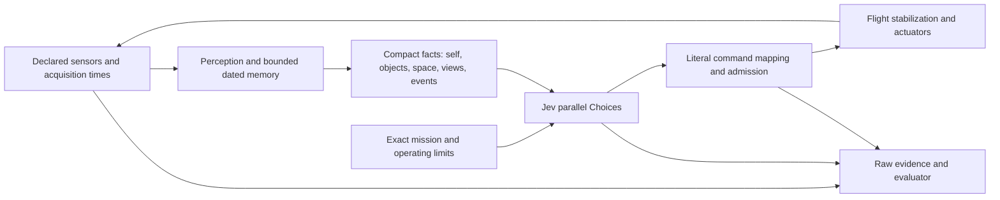

# Jev spatial control: five-round experiment handoff

Prepared 18 September 2026. This is an execution handoff, not a report of new inference. Earlier results below are measured; the five rounds are proposed. The accompanying [new-session prompt](jev-five-round-prompt.md) requests implementation, real inference, analysis and successive redesign, not just planning.

> **Superseded for new work, 2026-09-21:** this document's "use full relevant menus and explicit conditional branches" instruction (§ "New-session execution prompt" below and its own body) is superseded by F57–F61 and F75. The 43,218-tuple full factored menu these five rounds actually used produced 0/24 full-mission passes (F43) and 0/56 mission passes across the whole campaign; the small bounded menus that later worked (seven yaw actions, five range actions, twelve search actions, each carrying code-computed per-option consequences) are not "full menus" in this document's sense. New work should follow the [find-and-follow ladder](jev-find-follow-ladder.md) (F78) instead of this handoff's menu guidance; the mission sentence, ownership boundary and campaign-hygiene practices below (freezes, seals, disjoint development/confirmation, fresh-seed confirmation) remain sound and are reused there.

## Objective and ownership

Give Jev this exact mission in every main-task request:

> Find the blue car in this unfamiliar area and follow it as it moves. It may not be visible initially. Choose where to look and move, keep it in view, avoid colliding with surfaces, and find it again after losing sight.

Append the same explicit operating envelope and control contract to paired arms. State any following tolerance the scorer will enforce. Do not silently demand a metric distance from an arm without range observations; range observability can itself be an explicit comparison. Restricted camera or perception diagnostics are component tests, not completed missions.

**Jev chooses where to search, which object to pursue, movement, speed and camera motion.** Code acquires sensors, estimates observable facts, preserves dated evidence, converts units/frames, maps selected controls and stabilizes the simulated vehicle. No automatic search sweep, camera-centering servo, target follower, route planner, best-action ranking or hidden target position in the primary arms. Prior assisted runs remain useful references, clearly labelled. A fixed, logged command rejection/stop is not permission to substitute a better mission action.

The research objective is to find the smallest credible sensor/perception/state/control combination that supports that mission, or establish precisely which capability still fails. A negative five-round result is acceptable. Misattributing a scripted capability to Jev is not.

## Workspace, existing evidence and authorization

- Work directly in `C:/Users/danhm/tools/robots-world`. Important implementations and documents are untracked, and evidence is ignored. Do not switch/reset/clean the checkout, move it into an empty worktree, or overwrite old experiment directories. The current branch is `codex/jev-camera-research`; inspect current status again on arrival.
- Read [AGENTS](../AGENTS.md), [README](../README.md), [principles](../PRINCIPLES.md), [design](design.md), [all failures](design-failures.md), [latest spatial research](jev-spatial-awareness-research.md) and this handoff before changes. Robots World must remain a general robotics testbed; keep experiment-specific perception and policy outside its core.
- Nervelet lives at `C:/Users/danhm/tools/nervelet`. Only change it for a reusable acquisition/delivery/ownership requirement. Read its AGENTS, README, DESIGN and applicable future-design/harness contracts first. Do not add a drone schema, planner or parallel agent-memory system to its core.
- The user authorizes real TypeSafe Jev inference in Robots World using the already saved `.env.jev.local` key, and ordinary local implementation. Load credentials without printing or copying them into evidence. No hardware flights or purchases, publishing, or additional paid model services are part of this campaign.
- Existing Python perception environment: `.runtime/vision-env/Scripts/python.exe`; Node 24+. Verify availability. The local viewer normally runs on port 8870. Preserve other work and services.
- Use a new exclusive root such as `.runtime/experiments/jev-spatial-five-rounds-v1/`, with `round-01` through `round-05`, manifests and a campaign index. If it exists, inspect and resume its recorded state or create a distinct version; never overwrite it.

## What all previous test families established

Do not pool success counts across changing tasks, assistance, sensors or scoring definitions. Links identify the detailed designs, qualifications and raw evidence.

| Family and evidence | Result | What it permits us to conclude |
| --- | --- | --- |
| [Injected-delay comparison](comparison-results.md) | Deterministic policies with simulated controller delays. | Loop mechanics and timing only; not actual Jev or native-agent performance. |
| [First live Jev](jev-live-results.md) | Three 28 s flights plus an impaired-link case; high tracking scores with local guidance. | The live API/transport path works. This was not pixel-derived autonomous navigation. |
| [Structured mission comparison](mission-results.md) | Jev 3/3, Claude high 3/3, Claude low 3/3, hybrid 2/3; stale advice explains a hybrid failure. | Fast bounded mission judgments can work with structured site facts and macros. This is not visual search. |
| [Expanded flight controls](flight-results.md) | Twelve 45 s flights; no controller completed the mission. Jev median request latency about 254 ms, Claude 4.9 s, Codex 31.6 s. | Latency strongly differs in this harness, but speed alone did not solve the task. These are restricted integrations, not a general DroneRTS benchmark. |
| [Reactive loops](reactive-results.md), [correction](reactive-v3.md) | 24 attempts, 23 full; some brief attainment, no strict sustained-framing success. Preview horizon and applied-command lifetime differed. | Do not judge policy against a prediction using a different action duration. Later mechanics fixes do not retroactively improve old results. |
| [Eight Jev strategies](jev-expanded-results.md), [interrupted original](jev-strategy-results.md) | 32 flights across eight strategies; only one prose-strategy flight passed. Six additional axis-factor flights: 0/3 raw, 0/3 geometry. | Large fact tables, numerical scores and factorization did not establish reliable control. The six-axis menu represented 43,218 combinations; 255 was not the bottleneck. |
| [Physical-sensor representation](jev-physical-sensors.md), [forensics](jev-camera-representation.md) | Six 60 s flights, 0/3 with/without rangefinder; 1,436/1,436 decisions selected zero translation. Only one marker detection in 1,419 decision frames. | A marker-only representation discarded useful pixels. Independent mechanics showed movement worked. This does not establish that range is useless. |
| [RGB formulations](jev-pixels-results.md) | Fifteen 40 s flights, 2,149 decisions, zero sustained framing. Every drone moved, roughly 1.6–28.9 m. | Pixel measurements fix the earlier empty representation, but not the decision problem. Posthoc static successes were not independent flight success. |
| [Loop ablations](jev-loop-experiments.md), [deep diagnosis](jev-loop-diagnosis.md) | Twelve 40 s flights, zero framing. Initial corrections pointed away on 10/12 yaw and 11/12 pitch starts. All 1,662 relevant observations preceded the prior command's application. | Both action interpretation and causal feedback were wrong. API latency understated image-to-application delay: about 580 ms median, 700–780 ms p95. Stale-angle neutral semantics could undo commands. |
| [Hypothesis qualification](jev-hypothesis-results.md) | 144 real static calls, 22 flights. Direction/magnitude helped one static diagnostic (13/21 versus 1/21), but direct flight failed. Fresh-feedback qualification passed 637/637 transitions. A 0.35 confidence gate forced hold on 85/85 choices. | Mechanics, static classification, confidence gates and closed-loop policy must be scored separately. Fixing causal observation did not prove control solved. No complete mission success. |
| [Longer tracking](jev-tracking-results.md) | 73 valid flights, nine invalid, 38 unstarted of 120 planned. Constant-goal direct colour and KLT: 0/8 each. Camera-assisted colour and KLT: 6/8 each. | Longer time confirms assisted aiming, not direct steering. KLT was not necessary for equal pass counts. Service and pacing interruptions are not policy failures or completed tests. |
| [Best-trial retrospective](jev-minimal-tracking-review.md) | `colour-servo-1804`: 58.6/60 s continuous centering, 11.33 m travel, no contacts/bounds breach; full framing only 42.5%. Recovery and changed-size cohorts were weaker/incomplete. | This is the simplest clean assisted component success. Code aimed the camera. It does not satisfy the user's Jev-led search/navigation objective. F31 supersedes the servo-first recommendation, not these measurements. |
| [Obstacle fixture qualification](jev-scout-tests.md) | Fixed-observer feasibility checks and synthetic smoke; one scoring repair accounts for missing-frame gaps. | Some scenes require action to discover the target; others allow passive reappearance. Qualification contains no Jev mission results. |
| [Three scouting techniques](jev-scout-techniques-results.md) | 18 valid 120 s flights. Direct / camera assistance / assistance+memory: 0/6 mission passes each. Per 720 s flown, visible time was 6.6 / 250.1 / 225.0 s. All six turn-to-find runs made no search heading changes. | Assistance helps aiming. Delivered-view memory did not solve search. The best assisted obstacle flight had 15.05 s full framing, longest 9.8 s, not sustained mission success. |
| [Latest spatial research](jev-spatial-awareness-research.md) | Source review and proposed sensor-grounded state; no new inference or implementation. | Persistent geometry/view history is a hypothesis. It must not be described as already validated. |

Important late findings from [F28–F31](design-failures.md): a 0.4 s camera/KLT glimpse at 68.2/68.4 s fell between Jev observations at 68.0/68.6 s and never reached a request. Old flight-envelope requirements were absent from the goal and own-pose inputs. All scouting runs independently failed framing, so fixing the envelope does not create old successes. The old object was a uniquely blue box proxy, not validated semantic car recognition.

Raw report roots include `jev-pixels-held-out-v2`, `jev-loop-held-out-v1`, `jev-hypotheses-v1`, `jev-tracking-v1`, `jev-scout-qualification-v3` and `jev-scout-techniques-v1` under `.runtime/experiments/`. Each linked result document points to its specific reports. Start from [the latest visual laboratory](http://127.0.0.1:8870/.runtime/experiments/jev-scout-techniques-v1/index.html); do not select only its most attractive replay.

## Research that should govern the new design

### Jev's actual contract

The [official Choice documentation](https://docs.typesafe.ai/primitives/choice) allows **255 options per question**, recommends the full relevant list and says the model does not see question IDs. Put the axis, object and physical interpretation in instructions/option descriptions. Do not shortlist away difficult but physically available actions.

Questions operate independently against shared state. Conditional questions can be batched, then only the branch selected by Jev is dispatched; a sibling answer is not available while another question is being answered. [State](https://docs.typesafe.ai/concepts/state), [fan-out](https://docs.typesafe.ai/patterns/fan-out). Examples demonstrate [218 candidates](https://docs.typesafe.ai/cookbooks/semantic_find), [13 questions](https://docs.typesafe.ai/cookbooks/parallel_questions), and [54 function/argument questions](https://docs.typesafe.ai/cookbooks/function_calling). The [camera research catalog](jev-camera-representation.md) records the broader official cookbook review.

As checked on 18 September: `jev-1.13.0`, text input only, 64k total request tokens, 32k for state plus longest question; no separate question-count ceiling was documented. The advertised price is $0.042 per million input tokens; outputs free. Limits/prices can change, so recheck and pin/log the returned model. [Models](https://docs.typesafe.ai/models). Compact state is about relevance, throughput and interpretation, not squeezing observations into 255 entries.

Keep arithmetic and coordinate transforms in code. Literal wording, irrelevant state, numerical precision and continuous Score interpolation are known weak areas. [Jev limitations](https://docs.typesafe.ai/model-jaggedness/jev-1.13). Confidence is derived from the answer distribution; it is neither perception certainty nor verified flight safety. [Confidence](https://docs.typesafe.ai/confidence). The earlier blanket threshold immobilized the drone; no new threshold without a measured, separate treatment.

### What other projects actually contribute

The [source audit](jev-spatial-awareness-research.md) contains pinned code citations and an archived [seven-project audit](../.runtime/research/jev-spatial-2026-09-18/projects.md). These are inspected implementations, not independently reproduced benchmarks.

- [Featherless Simple Jev](https://github.com/featherless-ai/simple-jev) is an independent text classifier, not TypeSafe or an image encoder. Its JevPilot adaptation reads simulator object/route geometry and locally predicts/filters actions: [scan](https://github.com/featherless-ai/simple-jev/blob/0dd5396ffce671ab7c4bfc031506d8e558cf8d23/demos/jevpilot/src/simulation.js#L1024), [candidate construction](https://github.com/featherless-ai/simple-jev/blob/0dd5396ffce671ab7c4bfc031506d8e558cf8d23/demos/jevpilot/src/simple-jev-api.js#L26). Borrow compact grounded tables, not oracle inputs or hidden steering.
- [RomanSlack/jev-drone](https://github.com/RomanSlack/jev-drone/blob/cbeb53c/flight.py) uses simulator depth/segmentation and code-owned tracking/reflexes. Its [tunnel variant](https://github.com/RomanSlack/jev-drone/blob/cbeb53c/tunnel.py) still computes/blends following. Useful spatial fields; not proof of camera-only Jev control.
- [Jev Visual](https://github.com/hr98w/jev-visual/blob/19af545f096e8db4c4dd5d47aed42d92ec252111/demo/breakout/README.md) is an independent Qwen/MLX visual classifier. The improved Breakout demo selects lanes while code moves the paddle. Possible perception research, not a TypeSafe vision feature or drone result.
- [Otto's OCR](https://github.com/NobleSpartan6/otto/blob/c91ccce/desktop/ocr.ts#L28-L95) is genuine screenshot-to-structured-text grounding before Jev. [PS2 agent](https://github.com/opaielsheikh/ps2-ai-agent/blob/8b51b91/agent_bridge.py#L68-L165) extracts edge zones but also supplies steering suggestions. Edges are not measured clearance.
- [Doom](https://github.com/lukaske/jev-doom-agent), [Pong](https://github.com/safzanpirani/pong-jev), [Jev Autopilot](https://github.com/arielweinberger/jev-autopilot) and [browser-use](https://github.com/browser-use/jev-ultrafast) offer engine/RAM/known-world/DOM patterns. They do not establish the missing RGB-to-spatial navigation capability. See [game patterns](jev-game-patterns.md), [docs audit](jev-docs-audit.md) and the source audit for qualifications.

The user's [rocket discussion/gist](https://gist.github.com/pjburnhill/adf8d28efcad9df037bfdece178ef965) motivates the key ablation: does state already contain the recommendation, and does removing purportedly useful information change decisions? Treat community claims as context; verify API behavior in official docs.

### Sensor-only libraries worth testing

| Function | Source | Allowed output and limitation |
| --- | --- | --- |
| Car detection/identity | [YOLO detection](https://docs.ultralytics.com/tasks/detect/), [tracking](https://docs.ultralytics.com/modes/track/), [ByteTrack](https://github.com/FoundationVision/ByteTrack) | Boxes, class/colour evidence, provisional IDs. No metric depth or guaranteed identity after loss. Check licensing before redistribution. A blue cube fixture is not a valid semantic-car benchmark. |
| Stereo range | [OpenCV stereo](https://docs.opencv.org/4.x/dd/d53/tutorial_py_depthmap.html) | Calibrated, synchronized two-camera pixels plus known baseline can estimate metres. Invalid/occluded/textureless matches remain unknown. Use RGB images, not simulator depth buffers disguised as stereo. |
| Monocular depth | [Depth Anything V2](https://github.com/DepthAnything/Depth-Anything-V2) | Ordinary weights provide relative depth; metric variants are separate learned estimators. No scaling with evaluator truth. Measure domain error and local compute before adopting. |
| Own motion | [OpenVINS](https://docs.openvins.com/), [ORB-SLAM3](https://github.com/UZ-SLAMLab/ORB_SLAM3) | Camera/IMU ego-pose; not automatically a dense map. Skip if a declared onboard pose estimator already supplies sufficient estimates. |
| Spatial memory | [OctoMap](https://octomap.github.io/), [RTAB-Map](https://introlab.github.io/rtabmap/) | Posed measurements support observed-free/occupied/unknown space. Dynamic objects need ageing/separation. No visibility behind walls. |
| Object-centric scene representation | [ConceptGraphs](https://github.com/concept-graphs/concept-graphs), [Hydra](https://github.com/MIT-SPARK/Hydra), [Hydra sensor interface](https://github.com/MIT-SPARK/Hydra-ROS/blob/main/doc/hydra_ros_interfaces.md) | Useful representation ideas; upstream depth/pose/semantics are still necessary. Borrow a small representation before importing their large stacks. |

Related existing reviews: [optics/cheap-sensor corrections](jev-optics-audit.md), [next-tracking review](jev-next-tracking-review.md), [controller arrangements](controller-arrangements.md), [DroneRTS comparison](dronerts-comparison.md), and platform research on [controllers](research-controllers.md), [physics](research-physics.md), [networks](research-network.md), [testbeds](research-testbeds.md). Preserve their distinctions between wire compatibility, simplified dynamics and actual hardware qualification.

No reviewed evidence proves a complete solution on a cheap onboard computer. Record measured processing time, memory, image resolution and actual machine; do not convert desktop performance into an edge-board FPS claim.

## Small implementation target

Use the existing runner and optional modules. Avoid building an entirely new simulation framework or importing every library above.

Acquisition and physics continue during inference. Evaluator truth has no path into perception or policy. Suggested observation groups:

1. **Self:** acquired pose/velocity/attitude estimates, frame convention, calibration, age and uncertainty. A declared noisy GNSS/odometry simulation is allowed as a sensor model; never label exact transforms as physical estimates.
2. **Objects:** all relevant detected candidates, colour/class evidence, bearing/apparent size, dated ID and motion observations. Range only when the installed sensors/algorithm support it. Keep uncertain identity explicit.
3. **Space:** nearby measured surfaces, observed-free rays/volumes, unknown and stale regions, including vertical structure. One clear ray is not a collision-free corridor. Strict monocular arms keep unsupported metric fields unknown.
4. **Views/events/feedback:** inspected orientations and ages; bounded, acknowledged detector events; actual application of the previous command. Old target observations are historical, not fresh target location. Drop/overflow counts are visible.

Perception should return the same facts for the same sensor sequence regardless of mission. Goal-dependent object selection belongs to Jev, not a detector that only returns the evaluator's target. Deterministic spatial encoding, geometric binning and estimation are acceptable; a recommended action, route score or target-follow speed is policy assistance.

For a proposed control diagnostic, five values per XYZ axis produce 125 complete velocity tuples; nine yaw rates × seven pitch rates produce 63 camera pairs. Two Choices expose **7,875 command combinations**, and a later three-duration treatment would expose **23,625**. Every individual menu fits 255. Fix duration initially. These are discretized setpoints, not motor control or the full continuous action space. Compare joint and factored questions using the **same physical tuple set**, limits, coordinate frame and duration. State clearly whether zero means zero rate or hold the accepted setpoint. Define rate integration, expiry and camera/body mapping mechanically before judging Jev.

Do not simultaneously introduce this menu and a richer spatial observation and call the result a representation ablation. Retain a fully specified control condition while varying state, then freeze that state when varying controls. For conditional tool/object branches, put the condition in each question's text and dispatch only the branch selected by Jev. Never assume answers can read sibling choices.

Useful entry points: [scout runner](../experiments/jev-scout/run.ts), [scenarios](../experiments/jev-scout/scenario.ts), [scoring](../experiments/jev-scout/score.ts), [tracking trial](../experiments/jev-tracking/trial.ts), [pixel controller](../experiments/jev-pixels/controller.ts), [Python perception](../experiments/jev-tracking/perception.py), [audit](../experiments/jev-tracking/audit.py), [viewer](../web/pixels.ts). Inspect current APIs before editing. Old CLI defaults/manifests describe old pilot budgets/seeds; do not blindly replay them as this campaign.

## Five adaptive rounds

Each round must: **state hypotheses → freeze design → run real Jev tests → inspect logs/replays → append failures/findings → select the next round**. Finish five actual cycles. Do not pre-run all five fixed matrices, count planned/unstarted runs as execution, or stop after producing a plan. If a genuine service/resource blocker prevents completion, retain progress and say exactly which cycles are incomplete.

Use new development sequences for choosing contracts, then fresh within-round evaluation seeds. Once a round's results are read, those seeds are development evidence for future rounds. Round 5 uses untouched confirmation seeds. Never tune a running cohort or select replacement seeds because results are poor.

The following is a contingent agenda, not a requirement to advance past a failed prerequisite:

| Round | Main question | Initial matched experiments | Decision for the next round |
| --- | --- | --- | --- |
| 1: establish usable feedback | Can Jev receive and act on the information we already measured? | H1 event retention; H2 explicit command-frame/zero semantics. Two separate paired families. Qualify raw-pixel perception and actual applied controls first. | Choose the simplest reliable event/control contract. If direct look commands still fail, use round 2 to isolate representation/wording, not a larger navigation stack. |
| 2: spatial facts | Which extra facts help active discovery? | H3 inspected-view history; H4 numeric versus named spatial facts. If the missing information is demonstrably metric geometry, substitute H5 stereo instead of bundling it with history. | Keep additions only when they improve matched results and their acquisition/provenance qualifies. |
| 3: control decomposition | Does the same physical control space work better with different questions? | H6 joint versus factored camera/translation controls; H7 explicit conditional branch dispatch if needed. Same sensor state, plant limits and command tuples. | Select an interpretation the model actually executes correctly, including during target absence. |
| 4: pursuit and recovery | What still fails once acquisition occurs? | Choose two of H8 range, H9 ego-motion compensation, H10 timing from prior traces. Include moving targets, physical occlusion and active recovery opportunities. | Choose a minimal integrated candidate and identify one claimed-useful component for removal. |
| 5: confirmation and necessity | Does the candidate work in unfamiliar layouts, and which component matters? | Candidate versus strongest comparable direct baseline on eight fresh case/seed/fixture blocks; candidate versus one information-removal ablation on the same blocks. Reuse the candidate run within a block: three arms × eight blocks = 24 flights. | Deliver a qualified verdict, all failures, simplest working subset or precise unresolved limitation, and next recommendations. |

Default scale for rounds 1–4: **two hypothesis families × two arms × four matched fresh seeds = 16 flights per round**. Round 5 adds 24, for **88 planned flights**, plus recorded-sequence probes and qualification. Add matched replication only for a documented reason and within the campaign ceiling. This is a starting allocation, not a quota to waste on a broken pipeline. A failed prerequisite may redirect a later round to a focused component experiment with actual inference; identify its limited scope and do not claim the full mission was tested there.

Freeze round 5's eight `(case, seed, fixture version)` blocks before inference: **two turn-to-find, three translation-around-obstacle, and three physical loss/recovery**. Include at least two structurally new qualified fixture variants, one obstacle-navigation and one recovery variant, with different obstacle/route arrangements rather than only rotation or reflection. The existing scout generator largely mirrors/rotates fixed layouts; unused seeds alone do not establish unseen topology. Qualify feasibility and sensor coverage without policy-outcome tuning, use the same fixture within each paired block, and report each case separately. If fixture diversity cannot be qualified, retain the narrower confirmation and explicitly state that new-topology generalization remains untested.

Main-task episodes: normally 120 s, same duration per paired block. Select routes that offer at least 30–60 s of tracking opportunity after reasonable acquisition; report acquisition-time censoring. Where timeout is the hypothesis, compare 60/120/180 s as its own factor and evaluate common prefixes. Do not lengthen only promising flights. Follow time after acquisition and whole-episode performance must both be reported.

### Hypothesis bank: isolate rather than bundle

| ID and evidence | One change | How it can be disproved / measured |
| --- | --- | --- |
| H1: brief detections vanish (F28) | Latest-only observations versus identical state plus a bounded unread detection-event ledger. | Inject/replay a qualified short visible glimpse; measure acquisition→delivery loss and Jev response. Then matched live flights. Retention fixing delivery but not search is a distinct negative policy result. |
| H2: action semantics are misunderstood (F11–F19, F29) | Same commands described with explicit frame, zero and expiry semantics versus the existing wording; no movement assistance. | Balanced left/right/up/down, mirrored starts, neutral and already-aligned cases. Score mapping/application separately from model choice. Include more than one acceptable exploratory action when justified. |
| H3: lack of coverage memory causes ineffective search (F27, F31) | Current facts versus same facts plus dated inspected-view coverage. | Initially unseen target, multiple useful viewpoints, fixed-observer counterfactual. Measure novel observed area, actual heading changes and acquisition. Do not rank destinations in code. |
| H4: numeric/spatial encoding overloads Jev | Exact same measurements serialized numerically versus concise named bins/relations with documented thresholds. | Balanced recorded observations followed by fresh matched flights. Measure contradictions, relevant action diversity, tokens and mission effects; do not give one arm extra geometry. |
| H5: geometry is missing, not just wording | Same RGB/object pipeline plus calibrated stereo-derived surface facts versus unsupported range/space marked unknown. | Qualify disparity/false-free errors first. Then unseen-car wall navigation. Label this a sensor/information comparison, not a pure prompt comparison. Stereo must process two RGB frames. |
| H6: independent axes produce incoherent tuples | Equivalent full physical tuple set exposed jointly versus axis/direction factorization. | Match state, durations, legal tuples and units. Compare wrong-way/contradictory movement, search, latency and pursuit. Do not silently change the available speeds. |
| H7: same-call mode/object dependencies fail | Explicit speculative branches versus a separately committed prior mode, with otherwise equivalent commands. | Log every branch, chosen target, ignored outputs and added decision latency. Selection must not freeze all movement while target is unbound. |
| H8: apparent size cannot regulate distance | Identical qualified sensor setup; expose measured range versus mask it while retaining bearing/size. | Isolates the utility of acquired range after H5. Separate partial occlusion, target size variation and pose. Score physical distance only in evaluator, and disclose the observability treatment. |
| H9: image motion mixes ego and target motion | Raw pixel motion versus compensation using acquired ego-attitude/calibration. | Own yaw with stationary target, moving target with fixed camera, both moving. Do not give the car's world velocity to either arm. |
| H10: delayed commands outrun feedback | Change exactly one of sensing cadence, observation/application gate or command lease. | Same streams/plant otherwise; compare information age, repeated unobserved actions and overshoot. One world at a time; simulation continues while the API thinks. |
| H11: the detector/identity is the bottleneck | Colour regions versus a qualified small semantic detector, keeping identical downstream fields/controls. | Realistic car asset, blue distractors, two blue cars, truncation and occlusion. Detector output and compute must be measured; a proxy-object success is separately labelled. |
| H12: memory mistakes old evidence for current geometry | Same measurements/history with explicit age/uncertainty versus naive persistent records. | Moving car after occlusion, stale surfaces, reset/localization change. Count stale claims and unsafe action consequences. Never evaluate knowingly invalid memory as a deployable candidate. |

Run enough balanced static probes to diagnose interpretation, normally 40–100 per selected formulation, but they do not replace closed-loop flights. Labels must allow multiple reasonable actions; agreement with a hand-authored optimal route is not the objective. Mechanics scripts and evaluator-only geometry can establish feasibility, not act as Jev's policy or main competitor.

## Qualification, scoring and evidence

Before paid batches, qualify the smallest changed layer with recorded sensors and synthetic responses clearly labelled as such. Check coordinate signs, neutral/expiry behavior, acquisition during inference, event acknowledgement/overflow, reset authority, target identity and score coverage. For a new perception library, measure actual pixels→output on development fixtures. For a new map, test walls, gaps, overhead surfaces, low texture and stale/dynamic evidence. Ground truth may grade the estimator offline but may not calibrate per-frame outputs or select controller actions.

Declare a sensor inventory per arm: model, rate, noise/dropout, calibration, synchronization, compute latency, limits and unavailable fields. Own XYZ is not another object's location. A real position source or simulated sensor model must be named. Keep the rangefinder disabled unless a separately declared future arm explicitly requires it; this campaign prioritizes optics and onboard state.

Qualify both a turn-to-find scene that cannot reveal the car by waiting and a wall/viewpoint scene requiring translation. Retain fixed-observer counterfactuals. Occlusion reappearance alone does not prove active recovery. Any feasibility witness using privileged geometry belongs only to evaluator evidence. If improving scene assets for semantic recognition, qualify and freeze that scene version before policy evaluation.

Freeze per-round source hashes, dependency/model versions, exact mission/questions/options, sensor configuration, seeds, independent target routes, metrics and validity rules. Randomize/balance arm order within matched seeds. No arm-specific perception thresholds, target routes or safety helpers unless that is the named treatment. Start from the same common baseline for each single-factor family; promote combinations only in a later frozen round.

Hashes alone are insufficient: preserve an **immutable executable snapshot per round**, including source bytes, fixture/render assets, calibration/configuration, schemas and dependency lockfiles. Extend the existing exclusive `source/` snapshot mechanism rather than replacing it with hashes. Record model/perception-weight versions and checksums with reproducible retrieval references or retained local files. Verify the executed source against the snapshot before/after the round, keep credentials out, and preserve exact run/replay commands. Adaptive edits in round 3 must not prevent reconstruction of round 1.

Report separate outcomes:

- **Discovery:** first pixel detection, first Jev receipt, acquisition time/censoring, chosen look/movement and novel coverage.
- **Following:** visible and centered seconds, longest intervals, whole-flight and post-acquisition denominators, apparent-size framing; metric distance only under a stated evaluator definition. Do not use path length alone as tracking success.
- **Recovery:** number/duration of losses, time to new sensor and Jev detection, explicit actions during loss, passive-observer result. Missing sensor samples are unknown coverage, not silently successful tracking.
- **Control/timing:** exact selections and full probabilities, command acceptance/application/expiry, wrong-direction diagnostic counts, current sensor age and end-to-end latency p50/p95; backend request time separately.
- **Safety/validity:** contacts, stated-envelope violations, rejected actions, simulation pacing, sensor/model service failures. Distinguish policy failure, infrastructure-invalid, stopped and unstarted. Do not discard bad policies from averages.
- **Cost/realism:** reported tokens plus separately labelled uncertain charges, requests, processing time/memory, actual workstation, sensor assumptions and all code-owned assistance. A cloud model plus desktop perception is not demonstrated small onboard compute.

Predeclare pass thresholds before a batch, but keep continuous component results visible. Compare paired-seed deltas, per-seed consistency and uncertainty; four seeds are pilot evidence, not a universal ranking. Do not pool different missions into one win rate. In round 5, report every confirmation seed and whether the earlier improvement replicated.

Preserve each sensor acquisition/raw RGB (and stereo if installed), processed observation, serialized Jev request, returned model/options/probabilities, response, command and raw/decoded MAVLink, timestamps and source hashes. Reconstruct selected frames and every request→command mapping; include failures and canceled calls. Use bounds/retention that fit the campaign without silently discarding needed audit evidence. Do not log secrets or invent a reasoning transcript that the API did not return.

After every round publish a local visual page with hypothesis/one changed variable, paired summary, every replay, raw camera and perception overlays, exact mission/state/questions/options, event memory, chosen commands and application timeline. Label any spectator truth and assistance. Let the user inspect a success and a representative failure without hunting JSON files. Update the campaign index with round status, budget, conclusions and next-round rationale; browser-check viewer changes using the provided browser tools.

Append concise entries to [design-failures.md](design-failures.md) before and after each new design: hypothesis and evidence, one changed factor, outcome/denominator, contrary evidence, limitations and next decision. Add a durable `docs/jev-spatial-five-round-results.md` as results accumulate, linking the ignored raw evidence and visual index. Preserve earlier conclusions when superseded.

## Execution limits, persistence and completion

- Default to **one active simulated world and one controller owner**. Earlier concurrent high-rate trials were invalidated by pacing lag. Offline analysis can run separately; no competing writers to the same evidence root.
- Agent-set campaign ceilings: **160 real flights, 40,000 API requests and 500 million input tokens including conservative reservations for uncertain requests**, whichever occurs first. At the currently documented rate the token ceiling corresponds to about $21, not an assertion of actual billing or a user-specified budget. Include probes/retries/canceled calls in accounting. Freeze lower per-round allocations in advance, keep room for all five rounds, and do not silently raise ceilings. Verify pricing before starting; if materially changed, reduce work to retain this approximate cost ceiling.
- Reuse existing key/environment privately. Respect service limits and count SDK retries. Bound retry/backoff for read-only inference; never replay uncertain actuator effects. Preserve transient failures as attempts, and explicitly distinguish resumed/replacement runs. Pause dispatch on authentication/billing, schema, provenance, timing or budget invalidity. Diagnose before resuming with recorded justification; do not silently count a repaired run as the original.
- A budget ceiling or failed qualification should redirect remaining tests to smaller justified probes when possible. It is not evidence of a completed round. Do not claim five rounds complete if a real blocker prevents them; report the exact completed count and resume instructions.
- Write a durable campaign-state file after each batch with round, frozen manifest, attempt IDs, calls/tokens, completed analyses, pending steps and next command. Resume from this state after interruption/compaction, never start over or duplicate charged tests.
- For implementation run appropriate targeted tests plus `npm test`, `npm run typecheck`, `npm run build`; browser-check UI changes. For documents validate links/fences and `git diff --check`. Review changed sensor/policy boundaries independently before substantial paid batches, proportionate to the change; this is not a new permission gate.
- Keep working through all five cycles while authorized and feasible. Give concise updates during execution. No commit, PR, public upload or scheduled automation is needed for this request.

Completion means five executed and analyzed cycles, updated failures/results, a browser-opened five-round visual report, reconstructable evidence and a qualified answer: what Jev really controlled, what worked, what failed, which information mattered, how the result depends on assumptions, and what remains before realistic hardware testing.
