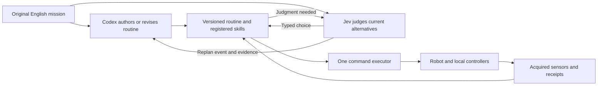

# Codex and Jev arrangements for English missions

Design proposals, 2026-09-17. These arrangements have not been implemented or compared end to end. The existing [live Jev measurements](jev-live-results.md) qualify bounded selections in a simple tracking fixture, not English mission completion or collaboration with a native agent.

The research question is: **how much of a native agent's repeated decision loop can a fast judgment model replace, and what should the native agent produce when it does participate?** Keep Jev-only as a serious candidate. Do not assume that either a hierarchy or an always-present native agent must win.

The follow-up [Jev research and experiment plan](jev-research-tests.md) inspects public controller code and defines the prioritized tests, fair baselines and decision criteria for these proposals.

## Shared mission and boundary

Use this illustrative mission:

> Inspect stations A, B and C. Prioritize any new fault alert. If a route is blocked, use another observed route. Return to base with at least 20% battery remaining.

All controllers receive the exact original English mission, the same observation capabilities, current job outcomes, and their own bounded history of observed events. English interpretation is part of the task. A Jev-only arm must not secretly receive a human-authored solution for each test mission. Instructions generated by Codex are separate artifacts; they do not replace the original goal text.

The proposed mission needs new station-inspection, battery and alert fixtures; those are not present in the tracking benchmark. A simulated sensor may expose measurements, but it must not return the evaluator's correct next action. Each arm shares the same feasible-action generator and local execution capabilities unless that component is explicitly under study.

Jev currently accepts text/structured state, not images, audio or video. Its documented outputs are Choice, Score and Noul judgments. A caller maps these to permitted tools or routines; Jev is not a native coding-agent session. Camera missions therefore need an explicit perception pipeline, with its accuracy, delays and costs included. Start with the same structured sensor evidence for every controller; compare camera pipelines separately. [State](https://docs.typesafe.ai/concepts/state), [API](https://docs.typesafe.ai/api).

## Arrangements

### 1. Jev controls directly from the original mission

Each decision receives the English goal, current observations, mission progress, recent receipts and a bounded set of concrete permitted calls. Jev chooses a complete action, such as traveling to an observed station, starting its inspection, returning to base, or waiting. The dispatcher supplies validated arguments from that candidate and records the result. Code retains observed progress between calls. No Codex session runs.

This tests genuine replacement at the mission-decision level. The control program still handles actuation and observation bookkeeping. Main risks are repeated locally sensible choices that fail the overall mission, poor recovery, and an action palette that cannot express a needed solution. Test paraphrased instructions, changed priorities and tasks requiring deferred reward. Add a menu-size sweep so success cannot depend on an unfairly narrow set of solved choices.

### 2. Codex writes a controller with Jev judgments inside it

Codex reads the mission and authors a bounded routine. Ordinary code owns arithmetic, iteration, completion checks, deadlines and known rules. The routine calls Jev at semantic branches, such as whether a new alert justifies interrupting an inspection, or which of several permitted recovery options best preserves the mission.

This uses a coding agent's ability to produce an executable program once. The routine can run after the native turn ends. DroneRTS already supports authored routines; the experimental change is access to a narrowly scoped, budgeted judgment operation inside the routine. Do not grant the routine the provider credential or unrestricted network access. Test the same authored routine with Jev, a deterministic replacement, and native-agent judgment at its decision points. Count authoring, validation and startup time in the total result.

Illustrative pseudocode, not an existing SDK:

```text
while mission is active:
    read current observations and confirmed outcomes
    update completed inspections from receipts
    if measured return reserve is insufficient: start return job
    otherwise continue the current valid job
    when an unfamiliar alert or blocked job needs a decision:
        ask Jev to choose among current feasible next actions
        recheck goal version, evidence age and capability
        admit the selected action
```

The local controller and independent acquisition continue while the judgment is pending. A numerical battery threshold belongs in code; the semantic priority decision is the candidate Jev role.

### 3. Codex prepares alternatives; Jev selects the relevant branch

Codex provides an explicit set of conditional plans or candidate routines before a decision becomes urgent: inspection-first, urgent-alert detour, partial completion and return, or a search recovery. Jev compares current observed circumstances against those alternatives and selects an applicable one. Plans name observed entities or procedures for acquiring evidence, never unseen map truth.

This spends native reasoning in advance and amortizes it across many later choices. It differs from asking Codex to write arbitrary code: alternatives can use existing registered skills and a small declarative plan format. The key failure is a confident selection when none of the prepared plans applies; include an explicit no-applicable-plan outcome and measured escalation. Test unexpected conditions outside the prepared set, as well as expected disruptions. Compare useful advance planning against the cost of unused branches.

### 4. Jev acts while Codex develops a longer-horizon plan

Jev starts permitted useful work immediately from the received mission. Codex consumes the same delivered evidence and reasons in the background. Its output is a proposed plan revision, not a second actuator writer. A local executor installs a revision only if its goal version, assumptions and observation references still apply. New revisions must not continuously restart already useful jobs.

This tests whether the drone can make early progress without losing the benefit of deeper planning. Measure progress before the first native response, plan acceptance/discard rates, reversal of prior work, interruption cost and final success. For actions that commit resources or foreclose future options, the executor follows explicit mission rules rather than assuming every early action is harmless. Compare continuous background planning against planning only on an event.

### 5. Jev decides when the native agent should wake

An existing route or routine does most execution. Jev watches changes and judges whether the current plan is still serving the English goal, whether progress is stalled, or whether a reported change merits a native turn. Nervelet delivers the relevant event and supporting evidence when the operator wakes. Reliable events remain retained until acknowledged; a learned wake decision must not silently discard them.

This is a small integration change and can be combined with arrangement 2 or 3. Jev does not steer here. It might reduce unnecessary native polling or spot a needed replan earlier. The difficult metric is missed useful wakeups, not just fewer calls. Compare deterministic wake rules, periodic native review, and Jev-triggered review with the same maximum unattended interval. Confidence is a measured routing signal, not proof of correctness. [Confidence routing](https://docs.typesafe.ai/patterns/confidence-routing).

### 6. Jev asks Codex to invent a missing skill

Jev selects among existing routines until progress fails or no candidate applies. It sends the native agent a bounded incident record: original goal, acquired observations, attempted actions, receipts and unresolved constraint. Codex may author a new routine or revise the action generator. The candidate program is checked in the experiment environment before a versioned installation. Existing valid work or a declared hold continues during this process.

This treats Codex as an occasional developer during a mission. It is appropriate only where code changes are permitted. Measure time to recover, whether the new skill actually expands capability, how often it causes regressions, and reuse across later tasks. Include a strong baseline with the same prebuilt skill catalog. Keep authored code in the native workspace and execution in the environment's existing isolated job mechanism; no second memory or workflow system is required. This is a later experiment because it combines inference quality, code generation and execution qualification.

### 7. Jev chooses what to observe next

Codex defines which facts matter to the English mission. Jev uses delivered sensor coverage, age, occlusion and uncertainty to choose a camera direction, a closer inspection, or another sensor request. A separate perception component processes the resulting observation. Codex handles mission reasoning from those results.

Here the accelerated decision is attention rather than motion. Test whether useful evidence arrives sooner and whether fewer expensive image interpretations are needed. Jev does not gain image understanding by selecting a camera action. Count observation movement, acquisition, interpretation and missed-detection costs. This needs a separately qualified perception fixture and should not be conflated with the current structured target tracker.

### 8. One Codex mission planner, one Jev controller per drone

Codex turns the English fleet mission into roles, constraints and priorities. Each drone's Jev selects actions from its own observations and actually delivered peer messages. Robots can evaluate proposed assignments or bids, but the message protocol owns claims, expiry and acknowledgements. Jev does not manufacture agreement between robots that cannot communicate.

Compare a shared native planner, one native pilot per robot, and decentralized Jev operation. Keep centralized and decentralized information access explicit. Test radio delay, loss, partitions and reconnection; measure duplicate work, neglected tasks, useful progress during isolation and consistency after reconnection. The existing radio fixtures are useful foundations; this fleet mission policy is proposed.

## A useful combination to build first

Start with **2 + 5**, and compare it against **1** and a capable Codex-only baseline. Codex produces a routine with occasional Jev decisions; Jev also identifies when that routine's assumptions no longer hold. Codex can revise it after an event. Authoring a new skill mid-flight (6) can be added later without being required for the first experiment.



Jev can ask independent questions in one request: which action is applicable, whether current progress is satisfactory, and whether a replan is warranted. Their answers do not depend on one another inside that request; code must resolve conflicts and execute only a compatible choice. TypeSafe documents parallel question evaluation, but its latency benefit needs measurement on our payloads. [Speculative fan-out](https://docs.typesafe.ai/patterns/fan-out). Candidate scoring is another variant; scoring rubrics and weights must be fixed before evaluation. [Composite scoring](https://docs.typesafe.ai/patterns/composite-scoring).

## First comparison and acceptance criteria

Use one controller interface and change its composition through experiment configuration. Preserve native sessions and their existing tools/routine support. Start with Codex Luna/xhigh as requested; replacing it with Claude is a separately named arm, not a silent fallback. Nervelet carries the operator's received goal, observation delivery, receipts, events, waits and cancellation. Domain jobs own continuous execution; the native harness owns reasoning and its workspace. Jev and mission schemas remain optional adapter/controller code, outside the generic library core.

The four initial arms are a capable native Codex pilot, Jev-only using the original English mission, Codex-prepared execution with Jev, and that prepared execution with event-driven native revision. Retain a deterministic routine as a negative control on tasks it can solve. All arms receive equal sensing and permitted robot capabilities. Generated skills are an explicitly measured experimental difference, with setup cost included.

Evaluate unseen seeds, instruction paraphrases, changes to one constraint, and explicit mid-mission goal replacements. Use two tiers: tasks solvable by the common skill catalog, and tasks with a genuinely missing capability. Freeze mission definitions and evaluation before running. Report each failure, not only successful runs.

Primary outcomes are mission completion under the stated constraints, total wall time and actual inference usage. Secondary outcomes include time to first useful action, progress during native inference, first observable evidence to recovery, missed/redundant native wakeups, incorrect plan switches, time acting on stale evidence, and physical interventions. Preserve candidate-generation inputs and rejected responses sufficiently to diagnose validation failures, with credentials and unrelated response fields excluded. The first live batch demonstrated why retaining only a generic validation error is insufficient.

Do not claim a Jev replacement from lower request latency alone. It replaces the native pilot only to the extent that it can finish the same English missions with the same capabilities and information. A hybrid earns its complexity only if its completed-task quality, latency or cost improves on both capable baselines.
