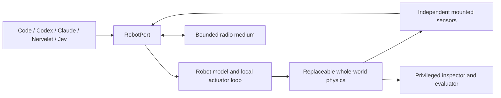

# Design: controllers see devices; evaluators see the world

The portable unit is a **robot I/O contract**, not an entire simulator. A robot has an identity, a model with command schemas, mounted sensors and a communication endpoint. Controllers consume acquired observations and submit bounded commands through `RobotPort`. They never need the renderer or simulator internals.

Keep the backend whole-world: contacts and joints couple bodies, so independent per-robot physics engines would misrepresent collisions. The backend declares capabilities; unsupported features fail during construction. World coordinates use right-handed ENU with SI units. Protocol adapters perform frame conversion at their boundary. Meshes are inspector data, never sensor evidence.

## Clocks and effects

Each fixed step runs local actuator loops, advances physics, acquires scheduled sensors and delivers eligible radio packets. Inference is asynchronous and runs outside this sequence. Headless experiments advance explicitly. The web host paces steps by wall time; if the host cannot keep up, simulation slows rather than inventing skipped physical steps. Acquisition and receipt use simulation time, while diagnostics and controller latency also retain wall timestamps.

Observations coalesce replaceable sensor readings. Jobs and inbox messages retain identity; reading does not acknowledge them. Every reading has acquisition time, receipt time, sequence and validity. Command admission, physical completion, expiry and cancellation are distinct. Command IDs reconcile duplicates within a lease; a changed payload under the same ID is rejected. An expired command stops its actuator operation. Controllers may attach observation provenance and a maximum age. A newer observation envelope never makes an old sensor sample fresh.

One lease writes each robot. Stop closes that lease before waiting for any model; a delayed tool response cannot regain authority. A new command replaces a running actuator job. Command admission is validated before applying effects. Model implementations must reject invalid domain arguments without partial side effects. Completed jobs, command receipts, sensor delivery queues, unread events, radio queues and inspector records are bounded. Event backpressure stops motion and blocks new effects until acknowledged.

`RobotPort.stop()` is terminal for that lease. Use the model's `hold` command for a temporary motion hold that retains ownership. A new controller explicitly claims another lease. Reset constructs a new world and invalidates all prior ports.

## Communication and isolation

Each radio has a channel, range, bitrate, latency, jitter, loss, packet limit and queue budget. A send receipt proves local queue admission only. Delivery checks range and partitions at the scheduled delivery time. Peers must implement acknowledgements over the same channel if they need confirmation. The inspector sees drop reasons; sender observations do not gain remote knowledge from them. Payload meaning belongs to the controller.

HTTP bearer tokens bind one robot and one lease; multi-port controllers receive an explicit set. Admin endpoints and truth inspection use a separate local token. The viewer bootstrap requires the fragment token in the startup URL, removes it from the address bar and keeps it in tab session storage. A robot token cannot obtain admin access from the bootstrap endpoint. The host binds loopback, rejects cross-origin browser requests, bounds queued work and prioritizes Stop over queued operations. These are application-level ownership boundaries, not an operating-system sandbox for an agent allowed to inspect the host filesystem. Run untrusted controllers in an isolated process/container with only their scoped endpoint credentials.

## What remains external

The native harness owns conversations, tools, compaction and inference. Nervelet owns its bridge semantics when selected. Orchflows guides bounded experiment work in the native host; it is not embedded as another scheduler. A real flight stack belongs behind a transport/robot adapter or an external simulation backend. Complex robot descriptions can be loaded by a future backend-native URDF/MJCF adapter; this version does not pretend to translate every physical feature into a universal schema.
