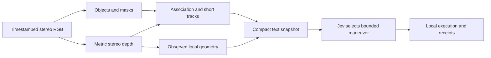

# Camera-derived spatial awareness for Jev

19 September 2026. Proposed experiments, not executed results. This extends the [research recommendation](../.runtime/research/jev-camera-follow-recommendation-2026-09-19/report.md) and [Round 2 results](jev-round2-results.md).

## Recommendation

Use synchronized calibrated stereo as the initial metric baseline. Run semantic detection/segmentation and stereo depth as parallel branches, associate their outputs from the same acquisition, then encode a small scene description for Jev. Start with tracked objects plus nearby geometry. Treat edge detection as an optional perception aid to test separately, rather than the main representation.



Preserve two distinct kinds of information:

- **Objects:** tentative track identity, class and colour evidence, bearing, estimated metric range, depth support, relative motion and last observation time. A tracker ID does not prove identity after an occlusion.
- **Geometry:** nearby occupied surfaces, observed free space and unknown space, including obstacles the semantic detector cannot name. An initial candidate is three elevation bands by nine azimuth sectors over the camera view; outside that view remains unknown. Sector coverage must remain explicit: a few valid pixels cannot clear a whole sector or flight corridor.

Keep transforms, range-error arithmetic and motion estimation in code. Jev still chooses the target and complete maneuver. Do not quietly replace its choices with a hard-coded pursuit controller. Keep acquisition independent of inference, bounded observations, explicit action receipts and existing ownership/Stop checks.

Illustrative text only; these are not measurements:

```text
goal: follow the selected blue car at 10 m, tolerance 1 m
target t7: car; blue; identity tentative; visible now
estimated surface range: 11.5–12.5 m
distance error: 1.5–2.5 m farther than requested
bearing: 8 degrees right
relative range trend: closing; estimate uncertain
left sector: observed free to 4 m; farther unknown
rear: unknown
last command: turn right; completed
```

Define range before testing: initially Euclidean distance to the nearest visible target surface, not camera-axis depth or an inferred car centre. Round 2 tested axial surface depth. Convert calibrated points explicitly and score the same definition that Jev receives. Depth quantiles are descriptive spreads until their error coverage has been measured; do not call them calibrated confidence intervals.

## What to retain and correct from Gemini

Detection plus depth is a sensible decomposition. However, its example reads the Hugging Face pipeline's `depth` image: the [implementation](https://github.com/huggingface/transformers/blob/main/src/transformers/pipelines/depth_estimation.py) normalizes each result to an 8-bit display image. The named [Depth Anything V2 Small checkpoint](https://huggingface.co/depth-anything/Depth-Anything-V2-Small-hf) estimates relative depth. Neither supplies metres merely by taking a median. Raw `predicted_depth` also needs a suitable metric checkpoint and its documented calibration. Our Round 2 used the separate metric VKITTI checkpoint; this example bug does not explain that experiment's failures.

A bounding-box median can select the background when it occupies most valid pixels. [DepthAI's spatial detection documentation](https://docs.luxonis.com/software-v3/depthai/depthai-components/nodes/spatial_detection_network/) discusses ROI/background and thin-object problems. Masks and foreground depth clusters are candidates to test, not guaranteed solutions. Preserve missing depth and foreground-support information.

Canny edges locate image intensity changes, including shadows and painted textures; they are not automatically physical obstacles. Semantic masks, depth discontinuities and image edges answer different questions. Benchmark their contribution separately. Library speed claims also depend on resolution, hardware, export and preprocessing. One rangefinder beam cannot remove all spatial ambiguity, and [ZED uses passive stereo](https://support.stereolabs.com/articles/6815914373-how-does-the-zed-3d-perception-work), despite Gemini grouping it with active systems.

## Necessary Robots World upgrade

The existing physics, robot I/O and command recording are suitable foundations. The current sensor renderer in `src/devices/pixel-camera.ts` renders simple boxes; Round 2 used procedural stereo fixtures. Neither establishes semantic car recognition in a moving 3D scene. The Three.js spectator viewer is not currently the camera evidence pipeline.

Add an experiment-specific textured 3D stereo camera adapter, with matched visual/collision geometry, explicit intrinsics/extrinsics and synchronized captures from the drone's actual pose. Reuse the simulation rather than changing core contracts. The controller receives RGB and explicitly declared onboard pose/IMU observations. Renderer depth, segmentation, object IDs and true trajectories go only to an isolated evaluator. Do not silently include the default simulated ray lidar or perfect odometry as camera-derived evidence.

First check camera calibration, rectification and alignment during translation and yaw. Verify that a pinned pretrained detector recognizes the rendered car assets before drawing conclusions about detector quality. Synthetic success will still need transfer checks on real recordings.

## Small experiments, one change at a time

Start with twelve ten-second recorded camera routes: four scene families, three seeds each. Families: target range changes; walls and thin obstacles; partial occlusion and lookalike cars; moving target with camera yaw/translation. Use two seeds per family for development and reserve the third for confirmation. Initial candidate rig: 640×360, 70-degree horizontal field of view, 0.20 m baseline and target ranges 4–18 m. These are proposed settings, to freeze before collecting scored results.

| Test | Change only | Main question and evidence |
|---|---|---|
| 1. Target depth association | Bounding-box median versus mask-selected foreground depth cluster; reuse the same frozen detector outputs and stereo images | Does foreground selection reduce range error and false background ranges without excessive unknown output? Grade support, error and usable coverage together. |
| 2. Distance wording | Current range versus the same range plus computed signed goal error; hold actions and other facts fixed | Does Jev stop choosing the wrong movement direction and correctly hold near the requested distance? This directly addresses Round 2. |
| 3. Unnamed obstacle awareness | Object list alone versus the same list plus coarse occupied/free/unknown geometry | Can Jev avoid a wall or pole outside the detector's known classes while still making useful progress? Log model choices separately from executor vetoes. |
| 4. Motion information | Current objects versus the same objects plus measured relative velocity; keep the underlying tracker and history exposure identical | Does moving-camera following improve without unsupported extrapolation? Test exposing a short history later as its own intervention. |
| 5. Perception scheduling | Detector every frame versus detector keyframes with tracking between them | How much capture-to-command latency can be saved before range, identity or following degrades? Fix camera rate, resolution, text and actions. |

Use warmed persistent workers. Existing SGBM is the first depth baseline; a small pinned segmentation detector supplies comparable boxes and masks. A learned-stereo challenger such as [Fast-FoundationStereo](https://github.com/NVlabs/Fast-FoundationStereo) is a later, separate replacement experiment. Avoid changing detector, stereo backend, text and control menu simultaneously. Test edges off/on separately if thin-obstacle results justify it.

Playback of identical recorded pixels isolates perception. Fixed observation probes isolate text interpretation. Then execute short matched-seed closed-loop trials: each arm's own motion must produce its subsequent images. Begin with an already visible stationary car, advance to moving following, then initially hidden search and occlusion recovery. Use one Jev-controlled drone and an environment-driven target. Preserve the same bounded movement options and guards across comparisons. A deterministic selector over that same menu can diagnose whether the sensor/action interface is sufficient at all.

For each test, freeze prompts, source/checkpoints, operating envelope, useful-performance floor and failure limits before inference. Select candidates on development data; do not promote whichever arm wins the reserved cases. The small pilot locates failures rather than establishing broad reliability.

## Latency and replay

Measure capture, perception completion, observation selection, actual Jev dispatch, response, application and completion separately. Choose the latest coherent observation at dispatch; never combine an old mask with a new depth map without explicit alignment and age. Drop superseded image work instead of building a backlog, while retaining unread events and command outcomes. Parallel branches may still contend for the GPU; measure achieved overlap.

Round 2's local CPU medians were approximately 77 ms for stereo and 864 ms for metric monocular depth; p95 values were 160 ms and 1,073 ms. These exclude capture and Jev and do not predict GPU/onboard performance. Start by measuring the actual hardware at a proposed 10 Hz camera rate and the existing Jev rate limit, then adjust only one scheduling variable per trial. Continual acquisition gives each new decision fresh input; it does not update an already dispatched decision. At a 3 m/s closing speed, an extra 250 ms corresponds to 0.75 m of motion.

Score target range error/coverage, obstacle false-clear reports, identity switches, useful Jev choices, time within the distance band, visibility/reacquisition, collisions, minimum clearance, context size and capture-to-application p50/p95. Inspect the first divergence in each failure. Replay should align stereo frames, masks/depth, exact delivered text, Jev's answer, actuator receipts and evaluator-only trajectory.

Advance only when an improvement survives fresh cases without trading away the declared collision/identity limits or collapsing into abstention. The desired outcome is the smallest representation with the best measured control/latency tradeoff in the declared envelope, not a universally ideal schema. No new tests, inference, model installations or hardware operations were run while writing this proposal.
