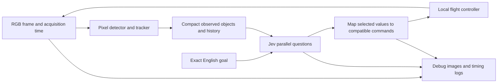

# Camera observations for Jev

Research checked 18 September 2026. **Recommendation:** turn RGB frames into a small, timestamped table of visible regions/objects and their recent image motion. Give that table and the exact English goal to Jev; ask explicit, parallel questions that select controls. Start with ordinary image processing, then replace the detector if the task requires semantic recognition.

The follow-up [optics and spatial-text audit](jev-optics-audit.md) checks the supplied Gemini research, corrects the OBB/depth/IMU claims, and proposes optional sector summaries and compute-budget tests.

The initial research changed the legacy sensor runner to camera-only; TF-Luna remains an optional Robots World device and prior evidence is unchanged. The follow-up [camera-only control pilot](jev-pixels.md) now implements pixel-derived colour regions, short history and five real-Jev control arrangements in a separate runner. The broader semantic-detector and depth-model experiments below remain proposals.

## What the recorded flights actually tell us

The six flights in `jev-sensors-held-out-v1` were real Jev inference, with camera-only and camera-plus-rangefinder arms. The forensic audit found:

| Observation | Implication |
| --- | --- |
| XYZ velocity was zero in all 1,436 completed decisions | This was Jev selecting no translation, rather than the replay failing to draw movement. |
| Only one marker detection across 1,419 distinct camera frames used by decisions | Most requests supplied almost no visual information useful for locating the target. |
| At that one detection, Jev still held position and tilted upward despite a target below the optical centre | Perception loss alone does not explain every decision; wording, coordinates and control decomposition need testing too. |
| Refreshing a fixed 0.6 m/s setpoint through the same port/MAVLink path moved about 1.01 m in two seconds, separately on each axis | A mechanics diagnostic established that movement can reach the plant. It was not an AI competitor or a mission result. |

Local audit artifacts are `.runtime/sensor-hover-diagnosis.json` and `.runtime/sensor-motion-mechanics.json`. The original [sensor experiment](jev-physical-sensors.md) documents its rendering, marker and flight-stack assumptions. A marker decoder returning no marker is not the same as a camera seeing nothing. Our representation discarded the rest of the image. The old mission also included metric/global requirements that these observations could not reliably establish. Changing several such factors together would prevent attributing any improvement to one cause.

## What the official documentation changes

| Verified guidance | Consequence for these experiments |
| --- | --- |
| [Choice](https://docs.typesafe.ai/primitives/choice) allows 255 options **per question** and recommends supplying the full relevant set. | Do not impose a 255-option budget across the robot's entire decision. Include an explicit none/unknown alternative when needed. |
| [Models](https://docs.typesafe.ai/models) documents parallel questions over shared text state: 64k tokens for the request, 32k for state plus the longest question. | I found no separate fixed question-count ceiling. Token and service limits still apply; record actual usage and latency. |
| [State](https://docs.typesafe.ai/concepts/state) accepts text/structured fields, not images. | Pixels need a perception stage. Base64, RGB numbers and ASCII art do not establish that Jev can interpret a camera image. |
| [Jev 1.13 limitations](https://docs.typesafe.ai/model-jaggedness/jev-1.13) describe weak numeric precision, literal interpretation and sensitivity to irrelevant detail. | Compute image geometry and named measurement categories in code. Ask semantic, narrowly scoped questions. Keep exact continuous control values out of Score interpolation. |
| [How to build](https://docs.typesafe.ai/concepts/how-to-build-with-system-one) separates ordinary software operations from atomic model judgments. | Perception, coordinate conversion, timing and dispatch belong in code. Mission choices can remain with Jev. |
| [Fan-out](https://docs.typesafe.ai/patterns/fan-out) evaluates conditional questions speculatively. | Questions cannot see one another's answers in the same call. Ask for each possible branch, then dispatch only the branch Jev selected. |
| [Confidence](https://docs.typesafe.ai/confidence) derives confidence from the probability distribution. | Record probabilities and confidence separately from detector quality. Neither is evidence of physical clearance. Calibrate any action gate as an explicit experimental factor. |

The official examples confirm the intended scale: [218 line candidates in one Choice](https://docs.typesafe.ai/cookbooks/semantic_find), [13 questions in one request](https://docs.typesafe.ai/cookbooks/parallel_questions), and [54 questions per function-calling request](https://docs.typesafe.ai/cookbooks/function_calling). The last example selects a function and its closed-set arguments, then ignores arguments for unselected functions. Its request shape is a particularly useful model for robotics.

An easy integration mistake: **the model does not see question IDs**. Put the object, axis and conditional context in `instructions`, not only in keys such as `o17_yaw`. [Choice request structure](https://docs.typesafe.ai/primitives/choice) explains which fields the model receives. Option keys and descriptions are visible; give them clear physical meanings.

## The smallest useful perception pipeline



Acquisition and perception continue while inference is pending. The controller receives the latest complete observation, including its age. Delayed responses retain their original observation provenance. A local flight controller still stabilizes the vehicle; this experiment concerns navigation and camera setpoints, not cloud inference controlling individual motors.

| Approach | Compact output it can support | Fit and limitation |
| --- | --- | --- |
| [OpenCV colour thresholding](https://docs.opencv.org/4.x/da/d97/tutorial_threshold_inRange.html) and [contour measurements](https://docs.opencv.org/4.x/dd/d49/tutorial_py_contour_features.html) | Coloured regions, centres, bounding boxes and apparent size | Simplest scripted baseline. A blue region is not automatically a rover. Use broad calibrated colour categories and include distractors, not an exact simulator colour lookup. |
| [Optical flow](https://docs.opencv.org/4.x/d4/dee/tutorial_optical_flow.html) or tracked detection boxes | Persistent observation IDs and image-plane displacement over time | Supplies continuity after a weak frame. Camera rotation, zoom and object motion can all change pixels; report compensation status and avoid inventing world velocity. |
| [YOLO-World](https://github.com/AILab-CVC/YOLO-World) with [ByteTrack](https://github.com/FoundationVision/ByteTrack) | Candidate semantic labels, boxes, scores and track IDs | A replaceable path for ordinary object recognition. Real-image training does not guarantee recognition of our simple rendered boxes. Measure recall and runtime first. |
| [Florence-2](https://huggingface.co/microsoft/Florence-2-base-ft) | Object boxes/labels or short region descriptions | Its base model has 230M parameters and supports structured detection/region tasks. Candidate for occasional semantic interpretation; model size does not establish device latency or factual reliability. |
| [SmolVLM2](https://huggingface.co/blog/smolvlm2) | Short frame/video descriptions | Another small vision-model candidate. An asynchronous description must retain the original image time and uncertainty. Count its inference cost and delay in the total. |
| Existing ArUco detector | Marker identity, bearing and pose estimates from known printed geometry | Useful supplementary evidence when decoded. Stop making successful decoding the prerequisite for all visual observations. |
| [Depth Anything V2](https://github.com/DepthAnything/Depth-Anything-V2) | Estimated relative depth, or separately trained metric estimates | A possible later arm. Relative depth is not metres; a learned estimate is not a rangefinder measurement. Keep it out of the first minimal comparison. |

Start with colour regions plus temporal tracking for explicitly visual tasks, such as finding a blue object among red and blue distractors. For goals requiring “rover,” “person,” or another semantic category, use a qualified detector and retain uncertain labels. Do not pretend a colour script supplies those semantics. Both implementations should emit the same observation shape; there is no reason to add a vision framework to the world core.

Example **proposed**, pixel-derived state fragment (illustrative values, not a recorded detection):

```json
{
  "goal": "Find the blue vehicle and keep it centred in the camera.",
  "camera": {"age_ms": 80, "horizontal_fov_deg": 70},
  "objects": [{
    "id": "o17",
    "appearance": "blue region; vehicle identity unconfirmed",
    "bearing": {"horizontal": "18 degrees left", "vertical": "6 degrees down"},
    "width_percent_of_frame": 6,
    "history": "over 0.4 s: shifted right in image; apparent width steady",
    "track_quality": "tentative",
    "ego_motion_compensation": "none",
    "range": "unknown"
  }],
  "last_applied": {"body_velocity_mps": [0, 0, 0], "camera_pitch_delta_deg": -3},
  "unobserved": ["outside camera view", "behind visible surfaces"]
}
```

Use roughly 200–500 state tokens as an initial engineering target, **not a measured optimum or a model limit**. Include all relevant visible candidates, calibrated camera orientation, stale/lost flags, and the latest applied-command feedback. Name coordinate frames explicitly. Preserve full boxes, calibration, raw numeric measurements and crops in debug evidence. Compute descriptive bins with fixed documented thresholds; “left” is a measurement, while “turn left now” is a policy recommendation.

Keep two or three recent measurements per track or a short derived trend. A missing current detection may retain `last_seen_ms` and its old bearing, clearly marked historical; it must not become a fresh predicted location without an explicit estimator. Send a complete current snapshot each call. State deltas alone require a memory mechanism Jev does not implicitly provide.

Image growth supports “larger in image,” not automatically “approaching.” Zoom, rotation, articulation and occlusion matter. Likewise, an angular gap between two boxes is not a certified flyable corridor. Absolute range stays unknown without declared scale or a qualified estimator. A known marker, known physical object dimensions or additional measured motion can supply extra constraints, but each changes the sensor assumptions.

## Many controls without enumerating every combination

The existing six menus contain 7 X velocities, 7 Y velocities, 7 Z velocities, 9 heading deltas, 7 pitch deltas and 2 zoom settings. Six Choice answers represent **43,218 possible combined commands**. This is discretization of the controls; it is not every physically possible continuous command, nor proof that independently selected components form a good joint action.

Two matched layouts should use precisely the same available tuples:

| Layout | Questions and options | What it tests |
| --- | --- | --- |
| Separate axes | X: 7; Y: 7; Z: 7; heading: 9; pitch: 7; zoom: 2 | Six parallel decisions with simple semantics. |
| Coupled horizontal movement | XY: all 49 pairs; Z: 7; heading: 9; pitch: 7; zoom: 2 | Five questions; can a joint horizontal decision improve coordination? No extra actions or geometry assistance. |

For a later experiment, another joint question could couple heading and pitch with 63 options. Make one change at a time. A large number of possible tuples is a property of the interface, not evidence Jev reasons correctly about all of them. Multiple axes may conflict; log the chosen joint result and any admission rejection.

Object selection introduces a dependency. A yaw question cannot read the simultaneous answer to “which object should I follow?” The simplest proposed conditional layout is:

1. One Choice selects `search`, `hold`, or `track_<observed ID>` for every current object.
2. Ask all six control questions for `search`, and all six for **each** possible tracked object. Each instruction explicitly says, for example, “Assuming the next action tracks observed object o17, select the camera pitch adjustment…” and references the same state.
3. Code uses the context selected by Jev and only that context's control answers. `search` still has model-selected controls; it does not invoke a hardcoded sweep. `hold` is a named tool action selected by Jev.

With three objects this is **25 questions in one call**: one context question plus four sets of six. There is no generated flight script and no code choosing the target. Use only compatible navigation/camera channels together; arming, mode changes or other prerequisite operations need acknowledged ordering, not blind parallel dispatch.

If a Choice really exceeds 255 entries, split candidates across questions in one request and use a further selection among retained candidates. Retaining several candidates rather than just one is a beam-style extension; the official [hierarchical cookbook](https://docs.typesafe.ai/cookbooks/hierarchical_classification) uses multiple candidate paths. This adds work and potentially another round trip. It is unnecessary for the present control menus. Any perception capacity limit must be declared and overflow logged, not disguised as a goal-aware shortlist.

A chosen context plus independently chosen arguments is still experimental control composition. Compare it against the simpler five/six-question baseline before adopting it everywhere. Total question count, input tokens, stale-state age and applied-command latency are the useful budgets.

## Keeping the experiment honest

Perception should take only pixels, declared calibration, acquisition time, earlier pixel-derived tracks and declared onboard measurements used for compensation. It must not accept the English goal, simulator bodies, depth buffers, object IDs or routes. Track IDs are generated by image association. Changing the goal while replaying identical inputs must leave perception unchanged.

Code may calculate centroids, angles, flow and units, decode pixels, normalize commands, enforce ownership and expire stale effects. It should not calculate the winning action, quietly aim the camera, rank actions by hidden outcomes, or replace Jev's hold with a scripted exploration move. Every effect—including a fallback—must be attributed in the trace. Stable flight-stack control is declared assistance shared by every arm.

One community example illustrates the distinction. At [RomanSlack/jev-drone commit cbeb53c](https://github.com/RomanSlack/jev-drone/blob/cbeb53ce4f17a06ea490ae43effcdad231143610/flight.py#L142), `Eye` builds compact sectors and target bearings. However, it enables MuJoCo **depth and segmentation rendering**, obtains target geometry IDs from the model, and computes target range from those buffers. Its structured summaries are interesting; those inputs are not ordinary RGB-camera perception. We cannot adopt its clearance fields under our camera-only claim.

The previously audited [StarCraft, Doom, Mario and browser examples](jev-game-patterns.md) offer useful question/dispatch patterns, but their structured game state, DOM access, scripted assistance or paused inference are different sensor and timing assumptions. Among the 18 cookbooks in the official index, I found no end-to-end RGB-drone perception recipe. The proposed bridge from those examples to pixels is our engineering hypothesis, not an official Jev capability demonstration.

## Experiments to run next

| Stage | Change | Hold fixed | Evidence needed |
| --- | --- | --- | --- |
| Pixel qualification, offline | Marker-only versus regions/tracks; later a learned detector if needed | Identical saved images and annotated visible objects | Detection coverage, false regions/labels, bearing error, identity switches, runtime. Include distractors, lighting shifts, clipping and empty frames. |
| Text representation | Numeric fields versus named spatial fields; then add short history | Same detector output, goals, controls and saved sequences | Jev selections, repeatability, cost and latency. Distinguish format-only changes from adding temporal information. |
| Control decomposition | Separate axes versus 49-option XY | Same observations, action tuples and question guidance | Whether selections coordinate, direction/sign mistakes, hold fraction and command validity. |
| Conditional object control | Direct six-question baseline versus context plus conditional controls | Same candidate objects and full controls | Correct target selection, reacquisition, time spent without progress, overhead from more questions. |
| Continuous camera task | Re-run the frozen contenders in matched changing worlds | Seeds, sensor timing, plant, communication and English goals | Sustained framing, recovery after target loss, collisions, translation/rotation, end-to-end response time. |

Begin with tasks observable from these sensors: find, centre, keep visible, distinguish distractors, reacquire, and maintain an explicitly stated apparent size. Then test following. “Stay exactly 5 m behind” or “remain within global coordinates” needs additional declared estimation; failure on an unobservable task does not isolate Jev's reasoning ability. These are new tasks, so report them separately from the old scores.

Use mirrored-frame and camera-orientation fixtures to qualify sign conventions. Use goals that select different visible objects on the same frame, empty scenes, abrupt target changes and prolonged loss. Never report movement alone as success. Preserve hold-heavy failures, invalid calls and collisions. Develop on one set, freeze source/perception/wording, then evaluate unseen seeds and goals without tuning against those outcomes.

The report should align **frame → detections/tracks → exact serialized state → complete questions → answer distributions → mapped commands → admission/application → physical movement**. Record acquisition, perception completion, request start/end and application separately; show p50/p95 age at actuation, not just API response time. Include all candidates and inactive conditional answers so a reviewer can see whether code chose anything. Overlay detected boxes and track IDs on the actual recorded camera frames. These are proposed additions; existing reports already preserve frames, requests and command traces.

Use ordinary functions/modules for perception and serialization, a controller-owned Jev request builder, and the existing sensor and RobotPort contracts. Robots World stays controller-neutral. Nervelet continues to own observation/lifecycle semantics rather than learning a Jev-specific planner. Version new request builders so historical report reconstruction does not silently change.

## Official cookbook inventory

The [documentation index](https://docs.typesafe.ai/llms.txt) listed these 18 cookbooks at the research date. All were retrieved; the control design above draws most heavily on function calling, pre-parsed extraction, parallel questions and conditional dispatch. Several others are catalogued for completeness, not recommended as robotics components.

| Cookbook | Pattern and relevance |
| --- | --- |
| [Noul self-consistency](https://docs.typesafe.ai/cookbooks/consistency_noul_cookbook) | Repeated binary judgments; useful model for repeated-state checks. |
| [Choice self-consistency](https://docs.typesafe.ai/cookbooks/consistency_choice_cookbook) | Repeated categorical judgments; separate consistency from correctness. |
| [Parallel questions](https://docs.typesafe.ai/cookbooks/parallel_questions) | Thirteen questions sharing one state. Reported speedups compare against sequential individual calls, not a concurrent-request baseline. |
| [Re-ranking](https://docs.typesafe.ai/cookbooks/rerank_typesafe) | One judgment per retrieved candidate; relevant for object-role matching, not a requirement to shortlist controls. |
| [Line-by-line search](https://docs.typesafe.ai/cookbooks/semantic_find) | 218 candidates plus a separate existence check; selecting a winner does not establish that any candidate fits. |
| [Structure recovery](https://docs.typesafe.ai/cookbooks/autoformat) | Two passes with conditional fields; real dependencies sometimes justify another request. |
| [Function calling](https://docs.typesafe.ai/cookbooks/function_calling) | 54 questions over tool names and closed-set arguments; dispatch only the chosen tool's arguments. |
| [Skill suggestion](https://docs.typesafe.ai/cookbooks/skill_suggestion) | Ranks all 182 skills, then examines three in detail; an intentional cascade, not a whole-request option cap. |
| [Entity alignment](https://docs.typesafe.ai/cookbooks/entity_alignment) | Evaluates 450 candidate pairs using a Score and three Noul questions per pair. Those are not 450 alternatives in one Choice. |
| [RAG passage classification](https://docs.typesafe.ai/cookbooks/classifying_rag_passages) | Four independent dimensions per passage; exposes judgments rather than hiding them in one label. |
| [Citation checking](https://docs.typesafe.ai/cookbooks/citation_check) | Deterministic source retrieval before semantic assessment; analogous to keeping image provenance. |
| [LLM guardrails](https://docs.typesafe.ai/cookbooks/llm_guardrails) | Separate hazard questions and explicit routing thresholds; not physical obstacle sensing. |
| [Structured extraction cascade](https://docs.typesafe.ai/cookbooks/sde_cascade) | Small generative model, Jev verification, escalation. Its verifier sees source text. Jev cannot verify an image caption against pixels it cannot consume. |
| [Date extraction](https://docs.typesafe.ai/cookbooks/date_extraction_cookbook) | Select components, reconstruct and validate in code; similar to factored tool arguments. |
| [Pre-parsed value extraction](https://docs.typesafe.ai/cookbooks/pre_parsed_value_extraction_cookbook) | Code finds possible values, Jev selects their role, code copies the grounded result. Closest analogy to detector boxes followed by target selection. |
| [Hierarchical classification](https://docs.typesafe.ai/cookbooks/hierarchical_classification) | Parallel beam search through a taxonomy; useful when the actual candidate space outgrows one Choice. |
| [Autoresearch feature discovery](https://docs.typesafe.ai/cookbooks/autoresearch_feature_discovery) | Jev judgments become features for a trained regressor. A learned downstream controller would be a distinct arm with its own training split. |
| [Classification using confidence](https://docs.typesafe.ai/cookbooks/classification_using_confidence) | A 75-label classification can fall back to a broader category. Uncertainty changes specificity; it does not establish real-world safety. |

Additional primary references: [structured criteria](https://docs.typesafe.ai/primitives/advanced), [smart-home demo](https://docs.typesafe.ai/demos/smart-home), [official JavaScript SDK](https://github.com/typesafe-ai/typesafe-sdk-js), [Python SDK](https://github.com/typesafe-ai/typesafe-sdk-python), and [official agent guidance repository](https://github.com/typesafe-ai/skills). These provide API and workflow references, not a camera decoder. The [community gist supplied by the user](https://gist.github.com/pjburnhill/adf8d28efcad9df037bfdece178ef965) remains useful context; official documentation and inspected code take precedence for capability and interface claims.
