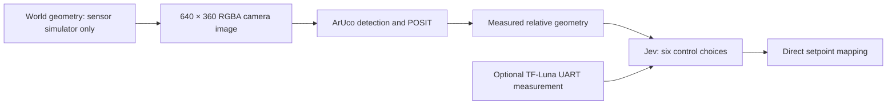

# Camera pixels and optional TF-Luna

The recorded experiment removed the informative simulated sensors used in the earlier Jev pilots. The controller received only measured camera features and, in one arm, a single TF-Luna beam. The small world core and its sensor/port contracts are unchanged.

As of 18 September 2026, `experiments/jev-sensors/run.ts` runs **only `sensor-camera`**. The optional TF-Luna module and historical two-arm results remain intact. Reproducing that comparison requires its archived source snapshot and manifest; the current runner is a camera-only legacy baseline. The [camera representation research](jev-camera-representation.md) explains the observed hover failure and proposes the next perception and control experiments. Those proposed experiments have not run.

## Device module

The [Benewake TF-Luna](https://www.dfrobot.com/product-1995.html) was listed at US$24.90 on 18 September 2026. Its [manufacturer manual](https://en.benewake.com/uploadfiles/2025/04/20250430174515390.pdf) specifies a 2-degree field of view, 0.2–8 m advertised range, centimetre resolution, 100 Hz default sampling and UART/I²C. The 8 m specification is for a 90%-reflective indoor target; the stated range for a 10%-reflective target is only 2.5 m.

Register the optional module with an ordinary registry map:

```ts
import { tfLuna } from 'robots-world/devices/tf-luna';
registry.sensors.set('tf-luna', tfLuna());
robot.sensors.push({
  id: 'front', type: 'tf-luna', hz: 50,
  latencyMs: 20, dropout: 0.02, maxAgeMs: 150,
  // Mount local +X points forward; mount quaternion can aim the physical beam.
});
```

Omitting the module and sensor has no effect on other worlds. The callback `tfLuna(bodyId => reflectance)` optionally supplies simulated material reflectance in (0,1]; its default is 0.1. Body IDs stay inside the sensor simulator. They are never in its measurement. The plugin uses existing independent acquisition, latency, dropout and staleness behavior. Sampling cannot exceed the world's tick rate; the Jev scenario requests 50 Hz rather than pretending its 50 Hz world acquires 100 independent samples each second.

`LunaParser`, `decodeLuna` and `encodeLuna` implement the real default nine-byte UART format: `59 59 distance-low distance-high strength-low strength-high temperature-low temperature-high checksum`. Serial defaults are 115200 baud, 8 data bits, one stop bit, no parity. Hardware uses 5 V supply and 3.3 V logic, shared ground, sensor TX to host RX, with host TX to sensor RX for configuration. I²C is an alternative, but this module implements UART decoding, not an I²C driver or configuration-command emulator.

The packet decoder handles fragmented/corrupt streams and marks weak, saturated and out-of-range measurements invalid. The default packet has **no acquisition timestamp**. Hardware must preserve host receipt time and declare any estimated acquisition delay; it must not claim the exact sensor acquisition clock available in simulation.

The sensor reading exposes distance or null, strength, temperature, measurement validity, raw UART bytes, fixed range/FOV limits and timestamp origin. Outer `SensorReading.valid` concerns delivery/staleness; inner `value.valid` concerns the physical return. Consumers must honor both. No object identity, hit point, world pose or free-space certificate is supplied.

The generic MAVLink adapter emits actual `DISTANCE_SENSOR` packets for installed TF-Luna sensors, even without odometry. The [standard message](https://mavlink.io/en/messages/common.html#DISTANCE_SENSOR) records mounting orientation, distance and time. Invalid/stale returns have quality 1 and distance 0; this is **not** a valid zero-distance measurement. Valid measurements use quality 0 (quality unknown), since signal amplitude is not a calibrated confidence percentage. The experiment's controller consumes decoded UART measurements through RobotPort; it does not claim that its sensor stream passed through a real flight controller.

The simulated optical response samples nine rays within the cone and blends returned distances by estimated amplitude. Missing parts reduce signal; mixed surfaces can produce a misleading **valid** intermediate distance. It does not use hidden identities to reject ambiguous returns or choose a useful obstacle. Range error is bounded uniform ±6 cm up to 3 m, ±2% farther away, plus configured noise, followed by centimetre quantization. The material/amplitude curve, beam integration and noise distribution are approximations, not manufacturer-calibrated optical models. Sunlight, glass, weather and optical interference are not simulated.

## Camera and legitimate preprocessing

The target has a real-world-reproducible **0.4 m ARUCO_MIP_36h12 marker, ID 0**, printed on its roof. Its top points toward the rover front; its centre is 0.092 m above the rover centre. The white quiet border increases paper size beyond the measured 0.4 m black marker border. Each run saves `marker.svg`; print dimensions must be measured, not assumed from the SVG's default display size.

This is an instrumented target, not arbitrary-object recognition. Marker dimensions/mounting, camera intrinsics and actuator calibration are declared knowledge. No actual target pose or route is supplied.

Jev receives these extracted features, not the RGB image. This first perception adapter does not detect unmarked objects or produce a visual obstacle map. A visible rover can have an unreadable marker, so geometric visibility in the evaluator is not evidence that the controller knew its location.



The optional software camera renders boxes and a printed plane with perspective projection and z-buffer occlusion. Pixel noise is added **before** detection. The [js-aruco2](https://github.com/damianofalcioni/js-aruco2) detector receives only pixels and calibrated intrinsics, then estimates pose from detected corners and known physical marker size. No true corners, simulator depth, visibility flags or target coordinates reach it. Detector settings use the eight-cell dictionary, a 64-pixel decoding warp, a three-pixel contour-separation threshold and exact dictionary matches. These fixed settings apply equally to hardware images.

The portable `markerDetector()` accepts rectified RGBA frames and `fx`, `fy`, `cx`, `cy`; it can process a real camera stream. Images must be rectified with a measured camera calibration first. Each supported zoom setting needs its own correct intrinsics. Pose estimates include both planar solutions and a reprojection error. Low reprojection error does not guarantee accurate range or orientation.

Ordinary code computes rover-relative displacement, separation, heading and camera-relative bearing from those **estimated** poses, known marker mounting and a simulated noisy onboard heading/gimbal reading. It receives no goal, action menu or world handle. It does not rank actions or compute a target waypoint. Ambiguous pose alternatives remain visible. If the camera reading is stale or no marker is detected, current derived geometry is empty. No hidden tracker fills missing observations.

Every camera acquisition saves the exact detector input as a PNG. The offline report hashes the file, reruns detection, checks the resulting measurements, reconstructs every Jev request and recomposes the applied command from Jev's six answers. Editing the image, detected pose, input state or chosen command causes the audit to fail. In the dashboard, the **What Jev could see** panel displays that PNG separately from the privileged 3D replay.

## Controlled comparison

| Arm | Controller-visible inputs |
| --- | --- |
| `sensor-camera` | Camera measurements, onboard heading/gimbal reading, derived measurement geometry, exact English goal, recent tool receipts |
| `sensor-tfluna` | Same inputs plus one fixed TF-Luna beam |

Camera: 5 Hz, 100 ms configured delivery delay, 2% frame dropout, 500 ms freshness limit. TF-Luna: 50 Hz, 20 ms configured delay, 2% dropout, 150 ms freshness limit. Its mount is 0.29 m forward, pitched 30 degrees down relative to the body. Camera pitch can change independently. The code **never associates a laser reading with the rover** just because the marker is visible.

Absent inputs are physically removed from the drone's sensor specification: global odometry, cooperative target messages, spherical range cloud, geometric camera depth and collision/contact oracle. The rover has private simulator odometry only to generate its motion; it sends no broadcasts. The old global-position envelope admission/delivery guard is disabled. Truth is used for image/range synthesis and scoring only, not to correct commands. Schema, source age, actuator speed, ownership, goal supersession and command expiry still apply.

Both arms retain the six complete fixed menus (43,218 tuples), the English requested-side/distance/framing mission, changing rover motion, moving obstacles and midpoint goal reversal. No selection is replaced with a more useful action. There is no scripted competing mission policy. The lower controller still stabilizes velocity/camera setpoints and brakes on expiry; it does not follow or avoid obstacles.

Development: seed 91, twenty seconds per arm. Held-out: seeds 1101–1103, sixty seconds per arm, alternating order. Both arms are retained regardless of score. Sensor configurations match; observed values naturally diverge after different actions. This is not a controlled comparison with previous pilots that had richer sensors. Source and configuration are frozen before held-out inference.

```sh
node --env-file=.env.jev.local experiments/jev-sensors/run.ts --phase development --seeds 91 --seconds 20 --output .runtime/experiments/jev-sensors-development-v2
node --env-file=.env.jev.local experiments/jev-sensors/run.ts --phase held-out --seeds 1101,1102,1103 --seconds 60 --freeze .runtime/experiments/jev-sensors-development-v2/freeze.json --output .runtime/experiments/jev-sensors-held-out-v1
```

Use fresh output directories; these commands never overwrite earlier attempts. Actual inference requires explicit credentials. Default tests use declared mechanics fixtures, not model-performance substitutes.

The first two development flights in `jev-sensors-development-v1` are retained. Review exposed an overly conservative sensor model that perfectly rejected mixed surfaces and also rejected ordinary oblique ground returns. The corrected model permits misleading mixed readings; regression tests cover both cases. Development v2 requalifies that correction. The change was a device-model correction, not tuning based on held-out outcomes.

## Recorded result: 18 September 2026

The six 60-second real-inference flights in `jev-sensors-held-out-v1` completed with matching paired environment trajectories, complete traces, zero controller/API errors and no hidden guard interventions. Frozen experiment source hash: `33865543bfff620221108713e512df9933da946362d194e703f929685bd716ec`.

| Input suite | Mission passes | Completed decisions | Inference p50 / p95 | Camera age at first command application, p50 |
| --- | --- | --- | --- | --- |
| Camera features | 0 / 3 | 719 | 217 / 339 ms | 500 ms |
| Camera features + TF-Luna | 0 / 3 | 717 | 215 / 359 ms | 580 ms |

Only **one of 1,419 distinct controller-observed camera frames** produced a marker pose. The valid TF-Luna counts at request time were **0/234**, **0/251** and **233/235** for seeds 1101, 1102 and 1103. A beam aimed at a distant dark surface can legitimately return no usable distance. Both readings' physical validity and delivery freshness are included in these counts.

These are failed mission trials with extremely sparse usable perception, not evidence that a rangefinder generally cannot help Jev. The image review showed occlusion and small, foreshortened roof patterns. A separate mechanics test verifies that the same printed marker on the actual box-shaped rover is detectable at a suitable viewing angle and remains unknown at an unreadable grazing angle. No controller or sensor tuning followed the held-out results. Reporting-only coverage counters and that regression test were added afterward; the original frozen report is retained as `report.frozen.json`, alongside the archived source and every original trace/image. The dashboard exposes this input-availability problem explicitly instead of equating evaluator visibility with a successful detection.

## What still prevents a hardware-readiness claim

The renderer is not photorealistic and omits motion blur, rolling shutter, lighting variation and lens effects. No model has yet been tested on a physical camera or TF-Luna here. The stabilized velocity/hold plant assumes a flight stack with its own state estimator. Motor/attitude dynamics, wind, that estimator and its GPS/VIO failure modes remain unqualified. The camera includes a simulated onboard heading estimate/gimbal encoder; the sensor suite is not literally an unaided camera and rangefinder with no flight electronics.

MAVLink movement has real binary framing, but the current camera setpoint travels as local JSON with it. A hardware adapter must implement the actual airframe yaw, gimbal and camera controls. The shared port, UART parser, pixel detector, calibration math and Jev decision code are reusable components; they are not a complete flight firmware image. A realistic sensor access boundary is necessary for transfer, but does not prove transfer by itself.
