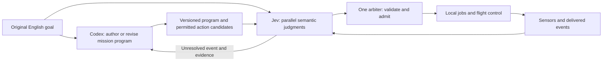

# Jev research and the next controller experiments

Research date: 2026-09-17. **The experiments below are proposed, not implemented or run.** This research did not launch paid inference. Earlier measured results are in [live Jev trials](jev-live-results.md); the broader design space is in [controller arrangements](controller-arrangements.md).

**Subsequent scope correction:** the user requested model-versus-model comparisons without a scripted policy competitor. The [live mission comparison](mission-comparison.md) implements that direction, including Jev interface tuning before held-out flights. The script comparisons below remain historical proposals, not the active experiment.

The question is whether a fast decision model can replace or bypass the long, serial deliberation between a native agent's observations and its next useful action. Keeping physics running during inference is necessary, but does not answer this question. The earlier tracking trials established connectivity and timing; every accepted Jev answer selected `follow`. They did not test English mission interpretation, changing priorities, or replacement of Codex.

## What Jev actually offers

TypeSafe describes a model architecture with parallel sampling and a training method called Reinforcement Learning for Calibrated Decisions (RLCD). Its published interface accepts text/JSON state and returns Choice, Score or Noul answers. The sources reviewed do not disclose enough architecture or training detail to reproduce Jev. Do not infer a particular model size, a one-forward-pass implementation, or an ability to run its weights onboard. [Launch article](https://typesafe.ai/blog/introducing-system-one-models-and-jev), [AI primer](https://docs.typesafe.ai/introduction/machine-learning-primer).

The important programming property is that independent questions about the same state can be evaluated together. A question cannot consume another question's answer within that batch. TypeSafe recommends narrow judgments and composing their results in code, including asking about possible branches before knowing which branch will be needed. The claim that additional questions add little latency is a hypothesis to measure on our workloads. [Introduction](https://docs.typesafe.ai/introduction), [speculative fan-out](https://docs.typesafe.ai/patterns/fan-out).

This is more flexible than a fixed classifier: the caller supplies English criteria and a changing action menu with each request. It can select a supplied tool invocation. It cannot invent a new tool implementation or generate arbitrary arguments. Camera interpretation requires a separate perception pipeline; current Jev state does not accept images, video or audio. [Choice](https://docs.typesafe.ai/primitives/choice), [state](https://docs.typesafe.ai/concepts/state).

TypeSafe's new Jev 1.13 limitations directly affect robotics: numerical precision, counting, indirection and irrelevant context can hurt performance. Independently asked judgments need not satisfy logical identities. The provider specifically cautions against reconstructing precise numbers by interpolating Score levels. Therefore compute motion, deadlines, counts and feasibility in code; experimentally test semantic selection. [Jev 1.13 limitations](https://docs.typesafe.ai/model-jaggedness/jev-1.13).

Choice/Score confidence summarizes the shape of the answer distribution; it is not an independent collision probability or a certificate that the chosen action succeeds. Calibrate each question and action family against our held-out outcomes. Do not multiply independently reported probabilities as if conditional independence had been established. [Confidence](https://docs.typesafe.ai/confidence).

## What the public projects establish

These are source inspections and authors' reported results, not our reproductions. Search covered GitHub repository search, general web search and community indexes. I found one directly relevant drone simulator repository and several useful adjacent controllers, but no verified physical-flight result in the material inspected. This is a search finding, not a claim that no other project exists.

| Project and pinned source | Useful pattern | Evidence limit |
| --- | --- | --- |
| [Jev Drone](https://github.com/RomanSlack/jev-drone/tree/cbeb53ce4f17a06ea490ae43effcdad231143610) | Tactical queries run beside local flight control; a separate tunnel experiment pipelines requests. | The obstacle-course baseline cannot express climbing. Its comparison does not isolate model quality. The tunnel result is explicitly partial. |
| [Jev Ultrafast](https://github.com/browser-use/jev-ultrafast/tree/452c1ad2dd628008f1d5608f28158d76e49e6cc0) | One English goal, dynamic legal actions, and speculative targets for each operation in the same request. A generative model supplies text only when needed. | Browser actions and page loading differ from continuous physical motion. |
| [Jev Browser](https://github.com/Ying-Kai-Liao/jev-browser/tree/b7118e8535b14fd524bc0509a3513e0d0a783a68) | A caller assigns an outcome; Jev runs a local observation/action loop and returns done, ambiguous or stuck. | Its documented failures include compound ordered goals and numerical verification. Reported task results are development results. |
| [Jev Plays StarCraft](https://github.com/phyous/tsai-sc/tree/6046ecc60156c4a3c04d384b41821a4ff08501b7) | Dynamic command candidates, observed action receipts and bounded encounter memory support a longer mission. | The game pauses for inference. One verified campaign victory is not evidence of live responsiveness or a win rate. |
| [TypeSafe Mario](https://github.com/fhshaik/typesafe-mario/tree/ca22449ed187118d19326d1f54b01b6636578aa4) | State includes own motion, action duration, recent outcomes and computed reaction deadlines. | Emulator RAM provides structured perception. Dashboard mode advances during asynchronous inference; the headless loop calls the policy before advancing frames. Those modes measure different timing problems. |
| [HEIST//ONE](https://github.com/AbdelStark/heist-one/tree/632c9a55a1e5eb2cbf0b9f87db575f0b5eb36e8c) | Four judgments for each of six guards share one request; results are proposals checked by code. | All guard contexts share the request state. Instructions restricting each question's attention do not enforce distributed information isolation. |

Specific source details worth carrying into tests:

- The drone's [tunnel request workers](https://github.com/RomanSlack/jev-drone/blob/cbeb53ce4f17a06ea490ae43effcdad231143610/tunnel_tactics.py) accept only increasing scene sequences; [navigation](https://github.com/RomanSlack/jev-drone/blob/cbeb53ce4f17a06ea490ae43effcdad231143610/tunnel.py) expires judgments after 300 ms. Pipelining raises throughput, but does not remove the age of the scene behind each answer. Its Score-to-position mapping is an experimental controller, not evidence of numerically calibrated control.
- The drone's [perception source](https://github.com/RomanSlack/jev-drone/blob/cbeb53ce4f17a06ea490ae43effcdad231143610/flight.py) uses simulator depth and segmentation with known target geometry IDs. It avoids directly sending hidden target poses, but is still idealized labeled perception rather than a demonstrated real-camera detector.
- The browser's [target questions](https://github.com/browser-use/jev-ultrafast/blob/452c1ad2dd628008f1d5608f28158d76e49e6cc0/jev_ultrafast/questions.py) are conditional: choose the target *if this operation is selected*. This is a useful way to avoid sequential tool/argument round trips. Validate the final operation/target pair again before execution.
- [HEIST's request compiler](https://github.com/AbdelStark/heist-one/blob/632c9a55a1e5eb2cbf0b9f87db575f0b5eb36e8c/apps/server/src/jev.ts) makes the batching/isolation distinction concrete: every question receives a state containing every guard's context. Use this pattern only for an explicitly centralized controller with legitimately received data.

## Recommended arrangement to challenge

My hypothesis is that Codex is most valuable when it converts an English mission into reusable behavior and handles unfamiliar problems. Jev should own recurring semantic decisions while that program executes, including while Codex is busy. Test this against genuine Jev-only control, rather than assuming a hybrid must win.

The original goal remains authoritative and is delivered separately from the generated program. A compiled plan is a derived artifact, not permission to reinterpret the mission. The arbiter remains the only movement writer. Codex revisions cannot overwrite newer actions blindly; goal versions, job identity, relevant evidence age and command preconditions must still hold.

Example mission: inspect stations A, B and C; prioritize newly reported active water leaks over routine wear; avoid occupied work zones; return with the required battery reserve. A delivered message about scheduled floor washing should have a different consequence from a message reporting a newly ruptured pipe. Battery arithmetic and motion feasibility are ordinary code. Interpreting an unfamiliar report in the context of the English mission is a candidate Jev job.

In one request, ask whether the report describes the prioritized fault, whether it concerns the current inspection, which offered inspection target fits, and whether the evidence warrants escalation. Code combines these results and dispatches the applicable action. A separate completion question may help, but only a recorded inspection result can establish actual completion.

## Experiment 1: can the decisions be decomposed without losing meaning?

**Question:** Does narrow, parallel questioning outperform asking Jev to choose the entire next action at once?

Build 40 development and 120 held-out snapshots across six families: urgent versus routine reports, temporary versus persistent occlusion, contradictory evidence, insufficient evidence, revised English constraints, and no suitable offered action. Keep paraphrase families and layouts separate across development and held-out sets. Define acceptable actions and required abstentions before querying; cases with several valid actions use an acceptable set, not a single arbitrary label.

Compare:

1. One Jev Choice over complete executable candidates, using the original English mission.
2. A batch of narrow Jev questions composed by a fixed, inspectable program.
3. Actual Codex Luna/xhigh choosing from the same candidates, without requiring a probability essay.

All arms receive the same observed facts, computed numerical quantities, action capabilities and outcome history. Candidate generation may filter mechanically invalid commands; it must not encode which mission choice is correct. Shuffle candidate order. Include an explicit defer/escalate option and a deterministic rule baseline on the cases expressible by those rules.

Record acceptable-action accuracy, inappropriate action rate, abstention coverage, per-family failures, latency and input usage. For Jev, plot empirical accuracy against reported probability/confidence without treating the two as interchangeable. Tune thresholds on development data only.

Separately measure 1, 4, 16 and 64 relevant independent questions over the same-sized state. Report request latency, total judgments and input tokens, including tail latency. This tests batching without conflating it with larger scenes. Do not use repeated copies of one question as the workload.

**Decision:** if factorization helps quality at similar latency, adopt it. If neither Jev formulation handles held-out mission conditions, constrain Jev to the successful subproblems rather than putting it in charge of the mission.

## Experiment 2: an event arrives while Codex is busy

**Question:** Can the robot act correctly on a new semantic event while its native controller is still processing an earlier observation?

Use the station-inspection mission above. Add timed reports, a changing work-zone boundary and a blocked inspection route. Give each report a physically meaningful response window; a correct decision after the window still counts as late. Hold event times fixed across paired runs and include both urgent and nonurgent reports. Log whether a native turn was pending at each event instead of assuming an artificial five-second thinking time. A pending native turn is an observable interval, not a measurement of private internal reasoning.

Run four arms with identical sensors, vehicle, guards and executable skills:

| Arm | Mission decisions |
| --- | --- |
| Native Codex | A real Luna/xhigh session using Nervelet, including routes and bounded authored routines as in the DroneRTS capability baseline. |
| Jev only | Original English mission, current observations and confirmed progress; no hidden Codex-authored mission planner. |
| Codex program + Jev | Codex prepares a mission program with typed judgment points; Jev handles those points while jobs continue. |
| Codex program + code | The same program with ordinary rules at the judgment points, exposing the incremental value of Jev. |

Give the native arm the opportunity to use its tools well; do not force tool-by-tool control. Report both cold mission cost, including authoring/validation, and warm execution. An authored program may be reused only in a declared warm arm. Preserve the original goal in every arm. Prevent shared workspaces or previous-run answers from leaking between trials.

Primary outcome: correct response **before the deadline**, over all events. Secondary outcomes: mission completion, instruction violations, false diversions, event-to-command application time, event-to-observed response time, native turns, API calls and total cost where known. Failures and timeouts stay in the denominator. Report events during busy turns as a predeclared subgroup alongside the whole run.

Start with ten paired world seeds as a pilot. This detects integration problems and estimates variability; it cannot establish a narrow success-rate margin. Freeze the final configurations and choose the larger evaluation size from that variability before collecting confirmation results. A proposed adoption target is at least a threefold reduction in p95 correct-response latency while mission success is within five percentage points of the capable native baseline and instruction violations do not increase. Require sufficient evidence for those bounds; a ten-run point estimate is not enough.

**Decision:** Jev-only success supports replacement for this class of mission. Hybrid success with Jev-only failures supports compiling/delegating bounded jobs. Equal hybrid/code performance means the benefit came from local execution, not Jev.

## Experiment 3: semantic choice versus a numeric steering signal

**Question:** Should Jev select a behavior or supply a continuously interpreted steering score?

Build a corridor with two viable detours around a central obstruction. Both left and right can work; their numeric midpoint cannot. Add cases where only one side satisfies the English mission, and cases requiring braking or gathering more evidence. Compare a Choice over complete, verified motion candidates against a graded Score mapped to steering, with identical perception, actuation limits and local guards. Keep the full distributions.

Measure collisions prevented by the guard, rejected proposals, oscillation, progress, clearance and success. In particular, inspect whether a probability distribution split across opposite steering levels produces an inappropriate intermediate command. Test increasing speed and acquisition delay; include own velocity and computed maneuver time in every arm.

This probes a possible failure mode; it does not assume that Jev will return that distribution. It also avoids rewarding a model merely because the baseline lacks a maneuver. Deterministic navigation must have the same climb, detour and brake capabilities.

**Decision:** prefer complete action or trajectory selection unless numeric steering provides a reproducible benefit. Model uncertainty between two actions must not silently become a third physical action.

## Experiment 4: is pipelining useful, or just more requests?

**Question:** After choosing a good decision interface, does concurrency improve timely decisions under a moving scene?

Compare one outstanding request against two and four, then compare fixed-rate queries with material-event-triggered queries plus a bounded refresh. Start from the same frozen semantic controller and a fixed dispatch ceiling. Also plot success versus total request budget so throughput is not mistaken for efficiency. Record requests attempted, completed, accepted, superseded, expired and cancelled separately.

Use monotonically increasing observation sequences and separate goal/ownership generations. An older response cannot replace a newer accepted decision. Reject expired evidence and incompatible goal/job changes. Do not invalidate a response merely because another physics tick occurred. Current command preconditions are checked again at admission. Keep at most one queued replacement snapshot and preserve unread events outside that replaceable slot.

Inject out-of-order responses, latency bursts and a goal change using a deterministic fake provider first. Then run real Jev with the same checks. Pipelining does not make a request's input younger, though it can reduce the gap between fresh accepted answers. Measure sensor acquisition to physical response, not just HTTP duration or responses per second.

**Decision:** increase concurrency only if it improves useful, timely outcomes per cost. Keep one outstanding request if the extra calls mostly expire or cause switches the vehicle cannot execute.

## Follow-on: swarms without an invisible shared mind

Only after the single-robot questions are answered, use four drones inspecting separate zones with duplicate reports, delayed acknowledgements, loss and a radio partition. Compare local Jev controllers against a centralized coordinator explicitly receiving telemetry over the simulated link. Test a coordinator batching several robots only on information that actually reached it; shared request state is not an isolation mechanism.

Measure redundant work, conflicting assignments, recovery after partition, coverage and radio load. Keep numeric task assignment and geometric deconfliction in a capable code baseline; the model's potential contribution is interpreting novel reports or priorities. A favorable fleet result must survive removal of spectator state and instantaneous peer knowledge.

## Implementation and logging boundaries

Keep experiment policy in controllers/integrations, fixtures in scenarios, and evaluation outside robot observations. The existing [policy-job boundary](policy-jobs.md) is the starting point for concurrent local work. Robots World's core remains provider-neutral. Nervelet retains acquisition/inference separation and goal/lifecycle ownership; it does not acquire a universal mission planner or a Jev-specific schema. See [Robots World principles](../PRINCIPLES.md) and the Nervelet repository's `PRINCIPLES.md` and `DESIGN.md`.

Before further live experiments, extend evidence collection to retain credential-free, bounded rejected provider bodies, HTTP status, validation failure paths and truncation markers. The earlier two validation failures cannot be diagnosed from their retained evidence. The StarCraft project reports probability-rounding incompatibilities, but that does **not** establish the cause of our failures; do not relax our validator based on that anecdote.

For every consequential decision, link:

1. Exact goal text/version, controller/model/source versions, question/program hashes and candidate descriptions.
2. Sensor acquisition, transport receipt and controller delivery timestamps; delivered event identities and action-history receipts.
3. Native turn pending intervals and provider request start/end; no invented reasoning traces or claims of access to private thought.
4. Raw answers, probabilities, uncertainty gates and the actual composition rule, including rejected and unused answers.
5. Candidate selection, command admission, application and observed effect; stale-rejection or fallback reason.
6. Mission success, all missed deadlines, resource budgets and trace completeness. Unknown usage or billing remains unknown.

The cockpit should compare these timelines beside the trajectories. Include sensor age at application and time spent under fallback, so a fast response cannot hide an old observation. Separate world-clock lag from model delay, and run online inference with unpaused 1x wall pacing. Preserve complete bounded evidence or explicitly mark a run incomplete.

The next implementation order is evidence fixes, the snapshot suite, then the busy-Codex mission. Numeric steering, concurrency and swarms are later experiments, not prerequisites for finding out whether Jev adds value.
