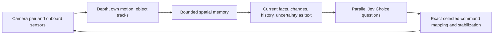

# Spatial awareness through text: lessons and next experiments for Jev

19 September 2026 · Research summary and proposed tests · No new inference or hardware testing performed for this document

## The premise

**Can a text-only decision model use a compact, sensor-derived, continuously updated representation of space to scout for an initially unseen object, follow it, and recover after losing sight?**

The mission remains:

> Find the blue car in this unfamiliar area and follow it as it moves. It may not be visible initially. Choose where to look and move, keep it in view, avoid colliding with surfaces, and find it again after losing sight.

The central experiment concerns how we represent the world: what exists around the drone, what it observed previously, what changed, and what it does not know. Control wording matters because Jev must translate its judgments into movements. It is a supporting requirement, not a substitute for testing spatial representation.

There are three separable questions:

1. **Estimation:** can affordable sensors and bounded computation produce reliable geometry, self-motion and object tracks?
2. **Encoding:** can we preserve the relevant relationships, history and uncertainty in a small text state?
3. **Decision:** can Jev use that state to choose exploration, pursuit and recovery actions?

The five-round campaign mainly tested image facts, limited history and control formulations. It did **not** adequately test a persistent spatial world model. Its negative result leaves the central premise open.

## What the completed campaign actually taught us

The campaign completed 56 valid 120-second flights, two retained infrastructure-invalid attempts and 440 real static component calls. No valid flight passed the full mission. This is evidence about the tested integration, not a general verdict on Jev. [Full campaign results](jev-spatial-five-round-results.md).

| Finding | Interpretation and limit |
| --- | --- |
| Blue-region selection succeeded in 440/440 static probes. | Selecting a supplied colour label was reliable; semantic car recognition and spatial control were not established. |
| Neutral axis wording removed persistent ascent in the pilot; factored direction/magnitude controls found blue in 2/2 pilot flights. | Interface wording and control decomposition changed behaviour. They did not solve following. |
| Final bare / verb / bearing-removed arms found blue in 5/8, 4/8 and 3/8 flights. | The proposed wording change did not confirm a general improvement. These are eight paired blocks, not a population ranking. |
| Final framed time was 0 / 3.65 / 0.20 seconds per 960 seconds flown; longest continuous framing was 1.4 seconds. | The failure was substantial, rather than a near miss at the mission threshold. |
| All nine final obstacle-search flights failed discovery. | Purposeful viewpoint selection around occluding geometry remains unresolved. |
| Event retention and dated view history did not establish mission success. | R1 generated no real blue glimpse; R2 history used the earlier problematic controls. Their value with corrected controls remains untested. |
| Removing explicit image bearings did not consistently worsen visibility. | Other spatial cues remained. This does not establish that geometry is unnecessary or that supplied bearings were being used correctly. |

The input was one 320×180 RGB camera at 5 Hz, processed into colour/neutral regions and tracked IDs. Jev received image bearings, apparent width, clipping and possible-occlusion flags, alongside noisy simulated own position/attitude and recent action receipts. Historical treatments preserved unread detections or up to 24 inspected views over 30 seconds. A 3×3 image grid reorganized the same image locations.

**None of those treatments supplied stereo depth, measured wall clearance, persistent 3D surfaces or a unified past-to-present spatial map.** Camera-rotation-compensated image-motion encoding was implemented but never tested in real inference. The later rounds concentrated on controls and image encoding. This scope gap is now recorded in [failure-log entry F44](design-failures.md#2026-09-19--f44-the-five-round-campaign-left-depth-and-persistent-spatial-memory-untested).

Measured timing also matters: final per-flight median API latency was about 299–333 ms, while p95 image-to-application age was 600–780 ms. An input can describe the world correctly at acquisition and be stale by execution. Onboard performance is unproven: perception ran on a desktop workstation, with roughly 37–40 MiB sampled worker memory and a final-round owner-process peak around 462 MiB. This is not the maximum across every earlier campaign process. [Timing records](http://127.0.0.1:8870/.runtime/experiments/jev-spatial-five-rounds-v1/campaign-metrics.json), [memory samples](http://127.0.0.1:8870/.runtime/experiments/jev-spatial-five-rounds-v1/memory-samples.jsonl).

## Jev's actual Choice and batching constraints

Official documentation rechecked on 19 September 2026:

- **Up to 255 options per Choice question.** This limits each answer menu, not the number of state facts, map cells or combined physical commands. [Choice](https://docs.typesafe.ai/primitives/choice).
- **Multiple questions run in parallel against the same state, independently.** A question cannot consume a sibling answer from that request. [State](https://docs.typesafe.ai/concepts/state).
- **“As many questions as we want” needs qualification.** The reviewed documentation does not state a separate question-count ceiling. It does specify 64k tokens for state plus all questions, and 32k for state plus the longest question. Service rate limits, cost and measured latency still apply. The pinned campaign model, `jev-1.13.0`, accepts text rather than images. [Models](https://docs.typesafe.ai/models).
- Speculative questions and conditional argument branches are intended patterns; extra questions still consume tokens. The official function-calling example uses 54 questions. This is support for batching, not a guarantee of unlimited throughput or coherent combined actions. [Fan-out](https://docs.typesafe.ai/patterns/fan-out), [function-calling example](https://docs.typesafe.ai/cookbooks/function_calling).
- Question IDs are not sent to the underlying model. Put the axis, target and conditional branch explicitly in each question's instructions and option descriptions; a key such as `follow_C7_yaw` cannot supply that meaning by itself. [API reference](https://docs.typesafe.ai/api).

Our existing controls already represented **43,218 physical combinations**. The 255-option limit was not the demonstrated bottleneck. We should first improve state while holding the available commands and their execution semantics fixed.

Parallel questions are not successive reasoning steps. Asking “which object?” and “how should I follow the selected object?” together does not communicate the first answer to the second. Either ask explicitly conditional controls for each offered object/mode and dispatch Jev's selected branch, or use a later call with the first answer included. A later call costs time and needs a fresh, consistently timestamped state.

## The proposed architecture and ownership boundary



Code may calibrate sensors, match pixels, estimate motion/depth, maintain geometry, transform coordinate frames, compute ages and serialize facts. It may compute descriptive relationships such as an opening's measured width relative to the drone's footprint. Those fields must have provenance and uncertainty.

Jev chooses the target, search direction, translation, speed and available camera/body motion. The primary experiment must not hide an automatic search sweep, target-aiming servo, approach-speed rule, route planner or best-action ranking in its “perception” layer. A measured gap is a fact; “take the left route” is a policy decision. Keep any candidate-specific motion prediction or collision checker as a separately labelled assistance treatment, rather than silently introducing it through the state.

Ordinary flight stabilization executes Jev's selected setpoints. Routine command expiry and stale-command rejection remain declared execution semantics: log them and predeclare their scoring treatment, without automatically equating them with a rescue. A supervisory safety takeover or replacement of Jev's chosen policy action must be logged separately and cannot support a claim of unassisted mission success. This separation makes success interpretable.

## Stereo vision: the first untested source of metric geometry

A synchronized, calibrated pair can estimate depth from disparity: `Z = f × B / d`, where focal length is in pixels, baseline and depth use metres, and disparity uses pixels. OpenCV provides stereo matching; low texture, ambiguous matches and occlusion boundaries require invalid/uncertain output rather than invented distances. [OpenCV stereo depth](https://docs.opencv.org/4.13.0/dd/d53/tutorial_py_depthmap.html).

**Illustrative calculation, not measured hardware performance:** with a 6 cm baseline and 400 px focal length, a point at 5 m has 4.8 px disparity. Assuming 0.5 px disparity uncertainty, first-order depth uncertainty is about 0.52 m; at 10 m it is about 2.08 m. A short baseline therefore does not automatically provide precise following distance at long range. These numbers omit calibration and timing errors.

The proposed stereo qualification should sweep baseline, resolution, exposure and processing rate. Include mismatched exposure, timestamp skew, motion blur, rolling-shutter distortion, plain walls, repeated texture, vegetation, thin poles, glass and occlusion edges. Record useful depth coverage and false-clear errors, not just average error on easy matched pixels. Test both static surfaces and a moving car; camera motion and object motion complicate temporal correspondence.

Output a few relevant surface/range intervals with coverage, age and confidence provenance. Keep target range distinct from background depth leaking into its bounding box. Validate correspondence and foreground association before claiming that “the car is 4 m away.”

## Making “cheap drone” an explicit constraint

Start with a fixed, calibrated stereo rig plus the flight controller's measured attitude and inertial data. Declare how local position/velocity is obtained. The earlier simulated position noise is not a demonstrated physical localization system. A camera–IMU estimator such as OpenVINS combines inertial measurements with visual feature tracks; it supplies an ego-motion estimate, not a complete dense obstacle map. [OpenVINS](https://docs.openvins.com/).

Freeze camera mounting as part of the plant. A cheap fixed camera does not provide independent gimbal pitch or optical zoom for free. Yawing the body changes the view; camera pitch changes may require vehicle attitude or actual gimbal hardware. A stereo pair must retain known relative calibration as it moves. Re-establish a common baseline when these assumptions change; do not directly pool its outcomes with the old camera model.

Define a hardware envelope before selecting products: total cost, payload mass, electrical power, usable flight time, companion-computer memory/compute, network link and sustainable sensor rate. Benchmark the entire pipeline on that device. No present result establishes that a particular inexpensive drone can run it. The current Jev API architecture also depends on connectivity; test delay, dropout and loss-of-link expiry while sensing and physics continue.

Also freeze the mission's working distances, target/drone speeds, minimum clearance and lighting conditions. Choose them against measured sensing range, end-to-end delay and vehicle stopping performance; a slow indoor demonstration would not establish the ability to pursue a fast outdoor car.

Other sensor comparisons should be separate, declared arms:

| Candidate | Useful question and limitation |
| --- | --- |
| One camera plus measured motion | Can parallax over successive translated viewpoints support sparse geometry? Rotation alone provides no triangulation baseline; moving objects need separate treatment. |
| Downward optical flow plus downward range | Can better ego-velocity estimation improve map consistency? This adds sensor capability; it is not forward obstacle depth. PX4 describes this arrangement for velocity estimation. [PX4](https://docs.px4.io/main/en/sensor/optical_flow). |
| Learned monocular depth | Does relative near/far structure help when stereo coverage is poor? Relative and metric checkpoints are distinct; validate scale/domain errors without rescaling to simulator truth. [Depth Anything V2](https://github.com/DepthAnything/Depth-Anything-V2). |
| A small forward or downward range sensor | Does one measured range materially help a constrained task? Its beam footprint is not a whole image, and it changes the declared sensor inventory. |
| Compact car detector and tracker | Can the system recognize the target under viewpoint, colour and occlusion changes? Detection boxes/classes are upstream evidence, not 3D coordinates. [Detection outputs](https://docs.ultralytics.com/tasks/detect). |

The blue-box task should remain a controlled component benchmark. A separate car-recognition stage must introduce realistic assets, blue non-car distractors, multiple cars, small/distant targets and identity ambiguity.

## Ways to encode spatial reasoning and history in text

These are **hypotheses to compare**, not demonstrated solutions. Build a canonical sensor-derived record first. Then vary its encoding without changing the underlying observations, controls or target behaviour. Arithmetic, transforms and age calculations belong in code; TypeSafe explicitly warns about numeric precision, indirection and irrelevant context. [Jev's documented limitations](https://docs.typesafe.ai/model-jaggedness/jev-1.13).

| Representation | What Jev receives | Main experiment |
| --- | --- | --- |
| **Body-relative sectors with vertical layers** | Fixed azimuth sectors × below/level/above bands; measured surface range interval, sampled coverage, age and unknown extent | Can it choose a useful view or movement with less text? Do sparse returns get mistaken for whole-sector clearance? |
| **Object and surface records** | Stable IDs; appearance/identity evidence; relative position/range; velocity estimate; extent, uncertainty and last observation | Does it distinguish a moving target from a static wall and avoid chasing a stale position? |
| **Explicit relationships** | “C7 last observed left of S3”; “opening G2 between S3/S4”; measured width/height intervals; current versus historical labels | Do grounded relations reduce the arithmetic and coordinate reasoning required of Jev? Compare against equivalent numeric facts. |
| **Local occupancy summary** | Observed occupied, observed free and unknown volumes, including overhead space; sample age and map uncertainty | Does accumulated geometry improve obstacle search? A 2D grid alone may hide overhangs. |
| **Viewpoint and coverage ledger** | Where the camera was, what direction it inspected, detection quality, and which areas remain unobserved or hidden | Does it reduce repeated fruitless looking and support a new viewpoint after occlusion? No destination ranking supplied. |
| **Changes plus current snapshot** | “Self moved”; “wall range changed”; “target lost”; “new surface”; recent applied action and resulting measurements | Can Jev connect a decision to its observed consequence? Test against raw chronological history with matched information. |
| **Motion-compensated history** | Previous observations transformed into the current body frame using estimated ego-motion, with original timestamps preserved | Does this prevent camera turns from being confused with target movement? Separate translation, rotation and object-motion uncertainty. |
| **Explicit target hypotheses** | Last measured state plus a few labelled possible present regions, expanding uncertainty and identity alternatives | Does it search after loss without treating a prediction as an observation? Compare simple last-seen memory before adding extrapolation. |
| **Topological places and openings** | Observed local places connected through measured openings, with visibility/coverage records | Does it help revisits and longer searches? Edges describe supported geometry, not an automatically planned route. |
| **Coarse overview plus local detail** | Nearby detailed facts and older/coarser surroundings, selected by a fixed spatial/age rule | Can bounded memory retain useful context without exhausting tokens or silently dropping a nearby hazard? |

[OctoMap](https://octomap.github.io/) offers a reference for occupied/free/unknown 3D space. [ConceptGraphs](https://github.com/concept-graphs/concept-graphs) illustrates persistent object-centric representations from posed RGB-D input. They are design references, not evidence that either complete stack fits this drone's compute budget. A small bounded implementation may be sufficient for the first experiment.

Compare plain prose, labelled tables/JSON and a small ASCII spatial grid using the **same facts**. An ASCII map needs a declared origin, orientation, resolution, height layer and unknown-cell symbol. Never let an appealing drawing hide missing dimensions. Compare numeric ranges with fixed named distance bands while retaining the underlying intervals; “near” must have a frozen physical definition. More text and more questions are experimental variables, not automatic improvements.

Memory needs a contract: bounded local extent and retention, stable IDs, acquisition timestamps, uncertainty growth, and an explicit coordinate-frame version. A localization reset invalidates or transforms old records; it must not silently reuse coordinates. Moving-object history is separate from static occupancy. A vanished detection does not clear a wall or prove that a car left the region. Observed-free rays describe their measured volume and time, not permanent empty space behind an obstacle.

Each request should be interpretable on its own. Supply a current compact snapshot plus selected dated changes; do not assume the API remembers earlier calls. If records are omitted to meet a bound, state the coverage and omission rule. Preserve unread short-lived detections so inference pacing does not erase the only glimpse.

### An illustrative state, with invented values

This is a proposed schema, not a reconstructed flight or a recommended action. Every metric field would require qualified measurements or an explicitly labelled estimate.

```text
snapshot: 142; map_frame: local-3; camera_age_ms: 140
self: height 1.8m; velocity forward 0.2m/s
pose_status: estimated; position_uncertainty_m: 0.25
body_axes: forward/right/up; distances are intervals

current_target_detection: none
track C7: likely blue car; last_observed_age_s: 1.4
  last_position_in_map: measured at that time; NOT current
  projected_last_position_now: forward 4.0-4.8m, right 0.8-1.5m
  current_position: unknown
  identity_alternative: C9 unresolved after crossing

surface S3: measured wall; front range 2.8-3.2m; age_s 0.2
  vertical_extent: observed up to 2.4m; upper edge unknown
opening G2: between S3 and S4; width 1.0-1.4m
  overhead_clearance: unknown; space beyond: unobserved
coverage: front inspected now; left inspected 2.1s ago;
  right and rear unobserved; no detection is not free space

change: C7 detection disappeared while near S3 image boundary;
  occlusion is suspected, not established
last_action: yaw-right command applied 0.6s ago
observed_result: body turned 8deg right; target still undetected
```

The important distinction is between **where a target was measured**, **where that old point lies relative to the drone now**, and **where the moving target might currently be**. These are different facts. A spatial memory should preserve that distinction explicitly.

## Using the Choice space without replacing Jev's decisions

First retain the current corrected controls for representation comparisons. After that, a separate control experiment could offer:

> **Overtaken, 2026-09-21:** this recommendation to retain the then-current controls (the 43,218-tuple factored velocity menu) is superseded by F53 and F57–F61: code-computed per-option consequences on a small bounded menu (seven yaw actions, five range actions), not the factored velocity menu, is what actually produced measured framing/range gains. See F78's [find-and-follow ladder](jev-find-follow-ladder.md), which uses the consequence-carrying menus throughout.

| Illustrative question | Choices |
| --- | ---: |
| Short body-relative XYZ velocity | 125 tuples: five declared levels per axis, including zero |
| Available yaw/pitch-rate pair | 63 tuples: nine yaw × seven pitch values |
| Bounded command lease | 3 durations |

This yields **23,625 combinations** across three questions, each under 255. It is an illustrative discretization, not the old 43,218-command menu and not a claim that a fixed camera has independent pitch control. Only offer physically realizable commands for the declared mount/plant. Explicitly define signs, units, frames, neutral behaviour and expiry.

Conditional questions can ask, for every offered mode/object, which velocity and camera command to use **if that mode/object is selected**. One separate Choice selects the branch; code performs exact dispatch. Every branch must have enough state context and remain within request budgets. Joint choices can reduce contradictory axis combinations, but no Cartesian-product calculation establishes reliable policy.

Additional parallel questions can diagnose whether Jev interprets target status, stale evidence, occlusion and unknown space correctly. Their answers cannot improve a sibling action answer inside the same call. If code uses those answers to override, filter or rank commands, it has introduced a new policy treatment. Keep diagnostic answers observational at first.

If there are more than 255 candidates, use a declared hierarchy with all branches represented where budgets permit, or a staged call. Do not quietly choose the “best 255” using privileged geometry or a planner. Small, physically complete discrete controls are preferable to enormous opaque action catalogues for the first spatial-state test.

## A concrete sequence of future tests

All stages below are proposed. The next work should identify the smallest representation that survives each stage, rather than launch another large mission batch immediately.

### 1. Qualify the sensors and state before asking Jev to act

Record synchronized stereo, IMU and the declared pose source through static scenes, translations, turns, moving targets and temporary loss. Produce depth, geometry and history from those records. Hidden simulator geometry may grade errors offline, but must never populate controller state, tune per-frame scale or select actions.

Measure bearing/range error by distance and texture, invalid-depth coverage, false-free space, clearance error, ego-motion drift, ID switches, memory ageing, reset handling and worst sensor-to-state age. Include low light, glare, blur, blank walls, thin obstacles and uncertain overhead clearance. A stable object should remain spatially stable as the drone turns. An independently moving target must not be absorbed into static geometry.

Freeze a minimum safety margin and maximum command displacement; then require measured error/age bounds to fit them. Do not invent universal centimetre thresholds before the camera baseline, speed and working distance are selected. Stop the dependent flight stage if the sensor pipeline cannot distinguish nearby occupied from unknown space reliably.

### 2. Test interpretation on saved decision sequences

Use, for example, 48 balanced sequences: 16 discovery, 16 following and 16 loss/recovery. Include mirrored layouts, pure camera rotation versus target motion, changing scale, stale detections, two similar cars, overhead obstacles and localization resets. Hold out whole layouts and motion patterns, not merely frame numbers from the same recording.

Use the same qualified sensor stream and corrected controls for a 2×2 information comparison:

| Arm | Current depth exposed to Jev | Persistent observation state |
| --- | --- | --- |
| A | No: bearings and apparent size | No |
| B | Yes | No |
| C | No: dated bearings/views and ego-motion only | Yes, with range unknown |
| D | Yes | Yes: accumulated geometry and object history |

A–B isolates current depth; A–C tests nonmetric history; B–D tests history/accumulated geometry with depth. C–D includes both depth and its downstream geometric memory; do not describe that contrast as depth alone. All arms share the same sensors and pose source, withholding fields for information ablations. A later one-camera hardware comparison separately tests sensor cost and capability.

Within a fixed information arm, compare numeric records versus equivalent relational wording, and chronological history versus snapshot-plus-changes. Do not add a detector, new controls and a new map simultaneously. Verify that nominally equivalent encodings contain the same facts.

Score factual interpretation, use of current versus stale evidence, wrong-direction choices and commanded motion against occupied/unknown regions. Permit multiple reasonable actions. A model answer about “free space” does not replace the sensor's uncertainty. Diagnostic success is a gate for live testing, not a mission pass.

### 3. Run a small, continuous closed-loop pilot

An illustrative starting design is four information arms × six matched blocks: two initially-unseen turn cases, two obstacle/viewpoint cases and two physical-loss cases, for 24 flights. Use one active world, balanced arm order, unchanged target routes within each block and a common qualified sensor/plant profile. Freeze source, state formats, model ID, scoring and budgets before dispatch.

Keep sensors and physics running during inference. Record acquisition, first Jev receipt, admission, application and expiry separately. Retain all requests, probabilities, images, measurements, commands, rejected actions and invalid attempts. Inspect why information helped or failed: an improved map is not useful if Jev ignores it or cannot choose the relevant movement.

### 4. Confirm the best spatial treatment on fresh tasks

Compare the selected treatment against both current-depth-only and the corrected monocular-information baseline on fresh structural layouts. Eight paired blocks across three arms would give 24 confirmation flights, including unseen starts, walls requiring viewpoint change and physical occlusion. Select the treatment before those seeds are used; do not tune on confirmation failures.

Report complete-mission passes and continuous components: discovery time/censoring, visible and centered time, following error, longest sustained following, contact rate, envelope breaches, recovery time and uncertainty. Use fixed-observer and held-at-loss-pose counterfactuals to distinguish active recovery from a car reappearing by itself.

For continuity, the old benchmark required acquisition by 45 s, at least 30 s post-acquisition, at least 40% framed coverage, at least 2 s continuous framing, no contacts/bounds/errors and no scored loss over 20 s. Its apparent-size/wide-view definition was specific to that fixture. Define realistic sensor/mount-appropriate following tolerances before the new freeze; report the old score only where comparable. Metric following distance needs an explicit declared tolerance and measurement/ground-truth grading contract.

### 5. Establish resource and realism limits

Replay on the intended companion computer before any claim about affordability. Measure sustained frame rate, memory, power, thermal throttling, state size, tokens per decision and image-to-action latency under load. Degrade pose, depth, communication and lighting separately. Never compensate for poor hardware by quietly giving the controller perfect pose or depth.

Then qualify car recognition and identity on realistic assets and recorded camera sequences, with small targets and distractors. Any later hardware flight is a separate stage, with the same declared assistance boundary and attributable interventions. Simulation success alone would not establish deployment readiness.

## The first test I would prioritize

**Qualify stereo geometry, then compare current depth against the same depth plus persistent, motion-aligned spatial history, with corrected controls held fixed.** Include the no-depth/no-history baseline and a nonmetric-history arm so we can identify what actually helped.

> **Overtaken, 2026-09-21:** this first-priority recommendation (persistent motion-aligned spatial history) is superseded as the *next* test by F53, F57–F61 and F75: history-based encodings did not survive their own comparisons (F53's richer-history arms centred for 0–2.4 s where receipts centred for 17–18.6 s; F57's own-history regression found no format won a new control trial), while code-computed per-option consequences (`after-bearing`, `after-range`, `sector-consequences`) did. The current priority is the [find-and-follow ladder](jev-find-follow-ladder.md) (F78), which tests those consequence encodings against a real sensor, real latency and search/obstacle fixtures for the first time — stereo geometry qualification (§ "Stereo vision" above) remains a live prerequisite, reused in the ladder's L3/L4/L8 range gates.

Start with compact object/surface records, a small occupied/free/unknown summary and a dated view ledger. Test a relational text encoding of those same facts before adding a large scene graph or learned depth stack. If the estimator fails, improve the measurements. If Jev misreads accurate records, improve the encoding. If it reads them correctly but chooses poor actions, the remaining failure lies in decision/control. That separation is the central learning objective.

## Evidence and status

Completed evidence: [five-round results](jev-spatial-five-round-results.md), [F44 scope correction](design-failures.md#2026-09-19--f44-the-five-round-campaign-left-depth-and-persistent-spatial-memory-untested), and the [local visual report with exact requests and replays](http://127.0.0.1:8870/.runtime/experiments/jev-spatial-five-rounds-v1/index.html). API and library references above are primary documentation checked on 19 September 2026. The stereo example and test allocations are proposals/calculations, not measured results. No hardware shopping list, guaranteed onboard rate, unlimited-question claim or new Jev experiment is implied.
